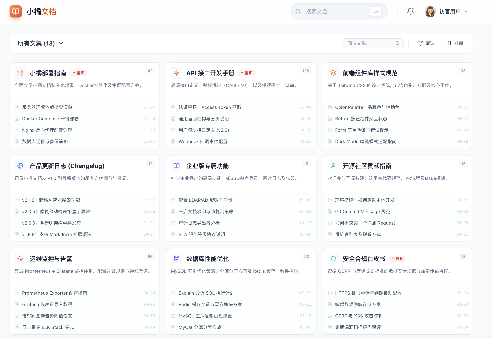

# 小橘文档 (LittleOrange Docs) 🍊

[](https://github.com/your-username/o-doc)
[](https://react.dev/)
[](https://vitejs.dev/)
[](https://tailwindcss.com/)
[](LICENSE)

一个现代化的知识管理与文档展示平台，基于 React + Vite + Tailwind CSS 构建，专为团队知识记录、文档管理和信息共享而设计。

## 📸 软件界面

<div align="center">
  
  <p><em>小橘文档 - 现代化知识管理界面</em></p>
</div>

## 🌟 项目特色

- **📚 知识记录** - 系统化的文档分类与管理
- **🔍 智能搜索** - 快速定位所需文档内容
- **📱 响应式设计** - 完美适配各种设备尺寸
- **🎨 优雅界面** - 现代化的视觉体验
- **⚡ 高性能** - 基于 Vite 的快速开发与构建

## 🛠 技术栈

### 前端框架
- **React 19** - 最新的 React 版本，提供卓越的开发体验
- **Vite** - 下一代前端构建工具，极速的开发服务器

### 样式与UI
- **Tailwind CSS** - 实用优先的 CSS 框架，快速构建现代化界面
- **Lucide React** - 美观的图标库，提供丰富的图标选择

### 开发工具
- **ESLint** - 代码质量检查与格式化
- **PostCSS** - CSS 后处理工具链
- **Autoprefixer** - 自动添加 CSS 浏览器前缀

## 🚀 快速开始

### 环境要求
- Node.js 20.19+ 或 22.12+
- npm 或 yarn 包管理器

### 安装依赖
```bash
npm install
```

### 开发环境
```bash
npm run dev
```
访问 http://localhost:5173 查看应用

### 生产构建
```bash
npm run build
```

### 代码检查
```bash
npm run lint
```

## 📁 项目结构

```
src/
├── App.jsx          # 主应用组件
├── main.jsx         # 应用入口文件
├── index.css        # 全局样式文件
└── assets/          # 静态资源目录
```

## ✨ 核心功能

### 文档展示
- 卡片式文档布局，支持图标、标题、描述
- 文档数量统计与置顶功能
- 响应式网格布局，自适应不同屏幕尺寸

### 搜索与筛选
- **智能搜索框** - 支持快捷键 (⌘K) 快速调用
- **分类筛选** - 按文档类型进行筛选
- **排序功能** - 支持按数量、名称等多种排序方式

### 用户体验
- **无限滚动** - 流畅的文档加载体验
- **动画效果** - 优雅的过渡动画和交互反馈
- **深色模式支持** - 适配不同使用场景

## 🎯 使用场景

- **团队知识库** - 构建团队内部的知识管理系统
- **产品文档** - 展示产品功能和使用说明
- **技术文档** - 管理API文档、开发指南等
- **学习笔记** - 个人或团队的学习资料整理

## 🔧 配置说明

### Tailwind CSS 配置
项目使用 Tailwind CSS 进行样式开发，配置文件 `tailwind.config.js` 已预设常用配置。

### 开发环境配置
- 支持热模块替换 (HMR)
- 自动代码分割和优化
- 开发服务器代理配置

## 📱 浏览器兼容性

- Chrome (推荐)
- Firefox
- Safari
- Edge

## 🤝 贡献指南

欢迎提交 Issue 和 Pull Request 来改进项目！

## 📄 许可证

MIT License - 详见 [LICENSE](LICENSE) 文件

---

**小橘文档** - 让知识管理更简单、更高效！ 🍊