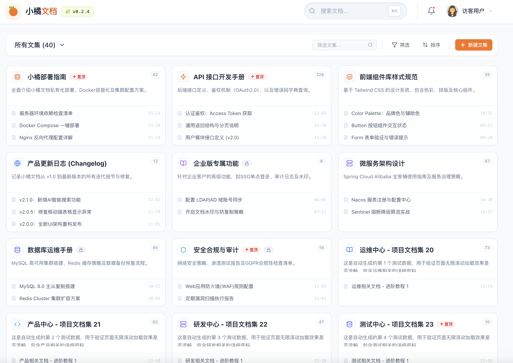

# 小橘文档 (O-Doc) 🍊

[](https://github.com/your-username/o-doc)
[](https://www.djangoproject.com/)
[](https://react.dev/)
[](https://vitejs.dev/)
[](https://tailwindcss.com/)
[](https://www.sqlite.org/)
[](https://www.docker.com/)
[](frontend_react/LICENSE)

一个现代化的知识管理与文档展示平台，基于 Django 5 + React + Vite + Tailwind CSS 构建的一体化项目，专为团队知识记录、文档管理和信息共享而设计，支持 Docker 容器化部署。

## 📸 软件界面

> 首页展示
<div align="center">
  
  <p><em>小橘文档 - 现代化知识管理界面</em></p>
</div>

> 文集目录
<div align="center">
  
  <p><em>小橘文档 - 现代化知识管理界面</em></p>
</div>

> 文章详情展示
<div align="center">
  
  <p><em>小橘文档 - 现代化知识管理界面</em></p>
</div>

## 🌟 项目特色

- **📚 知识记录** - 系统化的文档分类与管理
- **🔍 智能搜索** - 快速定位所需文档内容
- **📱 响应式设计** - 完美适配各种设备尺寸
- **🎨 优雅界面** - 现代化的视觉体验
- **⚡ 高性能** - 基于 Vite 的快速开发与构建

## 🛠 技术栈

### 后端框架
- **Django 5** - 高性能 Python Web 框架，提供完整的后端功能
- **SQLite 3** - 轻量级文件数据库，适合个人项目和小型应用

### 前端框架
- **React 19** - 最新的 React 版本，提供卓越的开发体验
- **TypeScript** - 静态类型检查，提升代码质量与开发效率
- **Vite** - 下一代前端构建工具，极速的开发服务器

### 样式与UI
- **Tailwind CSS** - 实用优先的 CSS 框架，快速构建现代化界面
- **Tailwind Merge** - 智能合并 Tailwind CSS 类名
- **Class Variance Authority** - 用于构建变体组件的工具
- **Lucide React** - 美观的图标库，提供丰富的图标选择

### 文档处理
- **React Markdown** - 强大的 Markdown 渲染库
- **Mermaid** - 支持多种图表类型的可视化库
- **KaTeX** - 高性能的数学公式渲染引擎
- **React Syntax Highlighter** - 代码高亮显示组件
- **Rehype Raw** - 支持在 Markdown 中使用原始 HTML
- **Remark GFM** - 支持 GitHub Flavored Markdown

### 路由与导航
- **React Router DOM 7** - 声明式的路由管理库

### 数据处理与可视化
- **Axios** - 强大的 HTTP 客户端，用于 API 请求
- **Day.js** - 轻量级的日期时间处理库
- **Recharts** - 基于 React 的图表库，用于数据可视化

### 开发工具
- **ESLint** - 代码质量检查与格式化
- **PostCSS** - CSS 后处理工具链
- **Autoprefixer** - 自动添加 CSS 浏览器前缀
- **TypeScript ESLint** - TypeScript 代码质量检查
- **Docker** - 容器化部署工具

### 构建与部署
- **一体化项目结构** - Django 后端与 React 前端统一管理
- **静态资源自动处理** - 前端构建产物自动集成到 Django 静态目录

## 🚀 快速开始

### 环境要求
- Python 3.11+
- Node.js 22.12+
- npm 或 yarn 包管理器
- Docker (可选，用于容器化部署)

### 安装依赖

#### 后端依赖
```bash
pip install -r requirements.txt
```

#### 前端依赖
```bash
cd frontend_react
npm install
cd ..
```

### 开发环境

#### 启动后端服务
```bash
python manage.py migrate  # 创建数据库表
python manage.py runserver
```
后端服务运行在 http://localhost:11800

#### 启动前端开发服务器
```bash
cd frontend_react
npm run dev
```
前端开发服务器运行在 http://localhost:5173

### 一体化构建与运行

#### 构建前端并集成到后端
```bash
cd frontend_react
./update.sh  # 构建前端并将产物复制到 Django 目录
cd ..
python manage.py runserver
```
访问 http://localhost:11800 查看完整应用

### 代码检查
```bash
# 前端代码检查
cd frontend_react
npm run lint
cd ..
```

### Docker 部署
```bash
# 构建 Docker 镜像
docker build -t o-doc .

# 运行 Docker 容器
docker run -p 8000:11800 o-doc
```
访问 http://localhost:8000 查看应用

## 📁 项目结构

项目的详细结构信息请参考独立文档：
- **[PROJECT_STRUCTURE.md](PROJECT_STRUCTURE.md)** - 完整的项目结构说明

## ✨ 核心功能

### 文档展示
- 卡片式文档布局，支持图标、标题、描述
- 文档数量统计与置顶功能
- 响应式网格布局，自适应不同屏幕尺寸

### 搜索与筛选
- **智能搜索框** - 支持快捷键 (⌘K) 快速调用
- **分类筛选** - 按文档类型进行筛选
- **排序功能** - 支持按数量、名称等多种排序方式

### 用户体验
- **无限滚动** - 流畅的文档加载体验
- **动画效果** - 优雅的过渡动画和交互反馈
- **深色模式支持** - 适配不同使用场景

## 🎯 使用场景

- **团队知识库** - 构建团队内部的知识管理系统
- **产品文档** - 展示产品功能和使用说明
- **技术文档** - 管理API文档、开发指南等
- **学习笔记** - 个人或团队的学习资料整理

## 🔧 配置说明

### 后端配置 (Django)
- **数据库**：默认使用 SQLite，配置在 `o_doc/settings.py` 中
- **静态资源**：前端构建产物自动配置到 `/static/` 路径
- **模板**：前端入口文件配置在 `templates/index.html`

### 前端配置 (React + Vite)
- **构建配置**：`vite.config.ts` 中设置了静态资源基础路径为 `/static/`
- **Tailwind CSS**：配置文件 `tailwind.config.ts` 已预设常用配置
- **自动集成**：`update.sh` 脚本自动构建前端并将产物复制到 Django 目录

### Docker 配置
- **Dockerfile**：定义了完整的构建和运行环境
- **启动脚本**：`start.sh` 包含数据库迁移和服务启动命令

## 📦 部署方式

### 本地部署
```bash
# 安装依赖
pip install -r requirements.txt
cd frontend_react
npm install

# 构建前端并集成
./update.sh
cd ..

# 初始化数据库并启动服务
python manage.py migrate
python manage.py runserver
```

### Docker 容器部署
```bash
# 构建镜像
docker build -t o-doc .

# 运行容器
docker run -d -p 8000:11800 --name o-doc-container o-doc

# 查看日志
docker logs -f o-doc-container
```

## 📊 数据库说明
- 使用 SQLite 轻量级数据库，无需额外安装
- 数据存储在项目根目录的 `db.sqlite3` 文件中
- 支持 PyCharm、Navicat 等工具直接连接查看数据

## 📱 浏览器兼容性

- Chrome (推荐)
- Firefox
- Safari
- Edge

## 🤝 贡献指南

欢迎提交 Issue 和 Pull Request 来改进项目！

## 📄 许可证

Apache License 2.0 - 详见 [LICENSE](frontend_react/LICENSE) 文件

---

**小橘文档** - 让知识管理更简单、更高效！ 🍊