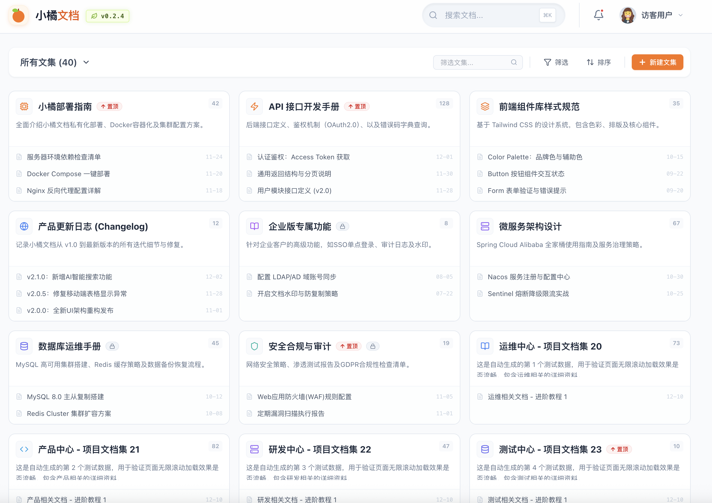
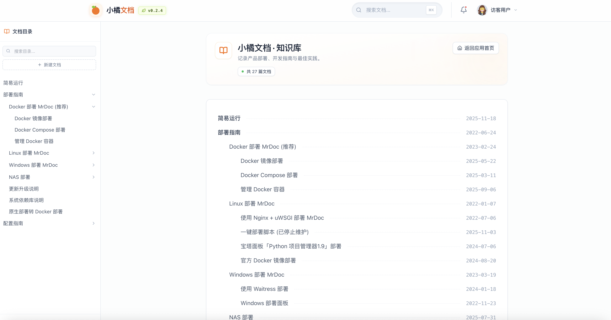
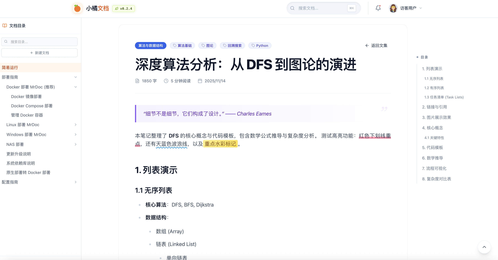

# 小橘文档 (O-Doc) 🍊

[](https://github.com/your-username/o-doc)
[](https://www.djangoproject.com/)
[](https://react.dev/)
[](https://vitejs.dev/)
[](https://tailwindcss.com/)
[](https://www.postgresql.org/)
[](https://www.docker.com/)
[](frontend_react/LICENSE)

一个现代化的AI知识管理与文档展示平台，基于 Django 5 + React + Vite + Tailwind CSS 构建的一体化项目，专为团队知识记录、文档管理和信息共享而设计，支持 AI 智能助手和RAG知识库。

## 📸 软件界面

> 首页展示
<div align="center">
  
  <p><em>小橘文档 - 现代化知识管理界面</em></p>
</div>

> 文集目录
<div align="center">
  
  <p><em>小橘文档 - 现代化知识管理界面</em></p>
</div>

> 文章详情展示
<div align="center">
  
  <p><em>小橘文档 - 现代化知识管理界面</em></p>
</div>

## 🌟 项目特色

- **📚 知识记录** - 系统化的文档分类与管理
- **🤖 AI 智能助手** - 集成多种 AI 模型，提供智能对话和文档助手功能
- **🧠 RAG 知识库** - 支持本地向量数据库存储和检索，实现基于文档的智能问答
- **🔍 智能搜索** - 快速定位所需文档内容
- **📱 响应式设计** - 完美适配各种设备尺寸
- **🎨 优雅界面** - 现代化的视觉体验
- **⚡ 高性能** - 基于 Vite 的快速开发与构建
- **⚙️ 系统配置管理** - 灵活的 AI 提供商和模型配置功能

## 🛠 技术栈

### 后端框架
- **Django 5** - 高性能 Python Web 框架，提供完整的后端功能
- **PostgreSQL 16** - 生产部署数据库，便于远程管理、备份和扩展
- **SQLite 3** - 本地开发默认数据库，无需额外服务
- **Django REST Framework** - 构建 RESTful API 的强大工具

### 前端框架
- **React 19** - 最新的 React 版本，提供卓越的开发体验
- **TypeScript** - 静态类型检查，提升代码质量与开发效率
- **Vite** - 下一代前端构建工具，极速的开发服务器

### 样式与UI
- **Tailwind CSS** - 实用优先的 CSS 框架，快速构建现代化界面
- **Tailwind Merge** - 智能合并 Tailwind CSS 类名
- **Class Variance Authority** - 用于构建变体组件的工具
- **Lucide React** - 美观的图标库，提供丰富的图标选择

### 文档处理
- **React Markdown** - 强大的 Markdown 渲染库
- **Mermaid** - 支持多种图表类型的可视化库
- **KaTeX** - 高性能的数学公式渲染引擎
- **React Syntax Highlighter** - 代码高亮显示组件
- **Rehype Raw** - 支持在 Markdown 中使用原始 HTML
- **Remark GFM** - 支持 GitHub Flavored Markdown

### 路由与导航
- **React Router DOM 7** - 声明式的路由管理库

### 数据处理与可视化
- **Axios** - 强大的 HTTP 客户端，用于 API 请求
- **Day.js** - 轻量级的日期时间处理库
- **Recharts** - 基于 React 的图表库，用于数据可视化

### RAG知识库
- **ChromaDB** - 本地向量数据库，用于存储和检索文档向量
- **Sentence Transformers** - 文本向量化模型，用于生成文档嵌入

### 开发工具
- **ESLint** - 代码质量检查与格式化
- **PostCSS** - CSS 后处理工具链
- **Autoprefixer** - 自动添加 CSS 浏览器前缀
- **TypeScript ESLint** - TypeScript 代码质量检查
- **Docker** - 容器化部署工具

### 构建与部署
- **一体化项目结构** - Django 后端与 React 前端统一管理
- **静态资源自动处理** - 前端构建产物自动集成到 Django 静态目录

## 📚 相关文档

项目的详细结构信息请参考独立文档：
- **[项目结构文档](docs/项目结构文档.md)** - 完整的项目结构说明
- **[接口文档](docs/接口文档.md)** - 详细的 API 接口说明
- **[前端代码规范文档](docs/前端代码规范文档.md)** - 前端 React + TypeScript 代码规范
- **[后端代码规范文档](docs/后端代码规范文档.md)** - 后端 Django + DRF 代码规范

## 🚀 快速开始

### 环境要求
- Python 3.11+
- Node.js 22.12+
- npm 或 yarn 包管理器
- Docker 与 Docker Compose（部署时需要）

### 开发环境

#### 安装依赖

```bash
# 安装后端依赖
pip install -r requirements.txt

# 安装前端依赖
cd frontend_react && npm install && cd ..
```

#### 启动开发环境

```bash
./dev.sh
```

脚本会自动检查并安装所有依赖，同时启动后端和前端服务。

- 后端服务：http://localhost:11800
- 前端服务：http://localhost:5173

日常前端开发请访问 `http://localhost:5173`。`http://localhost:11800` 是 Django 后端入口，只会加载已经构建并复制到 `templates/`、`static/` 的前端产物；`./dev.sh` 不会自动执行前端 build。

前端 Mock 数据默认关闭，会通过 Vite 代理访问真实后端接口。如需启用 Mock 演示数据，可执行：

```bash
VITE_ENABLE_MOCKS=true ./dev.sh
```

更完整的开发、构建和部署流程请查看 [部署与更新指南](docs/部署与更新指南.md)。

按 `Ctrl+C` 可停止所有服务。

### 代码检查
```bash
cd frontend_react
npm run lint
cd ..
```

### 部署安装

推荐使用一键安装脚本完成安装、更新和卸载。

#### 使用方式

Linux / macOS:

```bash
bash -c "$(curl -fsSL https://raw.githubusercontent.com/TangerineSpecter/O-Doc/master/manager.sh)"
```

Windows PowerShell:

```powershell
irm https://raw.githubusercontent.com/TangerineSpecter/O-Doc/master/manager.ps1 | iex
```

脚本会自动完成部署目录准备、配置生成和镜像拉取。
运行后按提示选择对应操作即可：

- `安装`
- `更新`
- `卸载`

安装时如果你没有输入 `DJANGO_SECRET_KEY`，脚本会自动生成；`DJANGO_ALLOWED_HOSTS` 默认使用宽松配置，适合大多数个人部署场景。

部署与维护的详细说明请查看 [部署与更新指南](docs/部署与更新指南.md)。

## ✨ 核心功能

### 文档管理
- 卡片式文档布局，支持图标、标题、描述
- 文档数量统计与置顶功能
- 响应式网格布局，自适应不同屏幕尺寸
- Markdown 编辑器，支持丰富的文档格式
- 文档大纲自动生成

### AI 智能助手
- 多 AI 提供商支持（OpenAI、Ollama、DeepSeek 等）
- 多种 AI 模型配置
- 智能对话功能，支持上下文理解
- 流式响应输出，提供流畅的交互体验

### RAG 知识库
- **本地向量存储** - 使用 ChromaDB 实现本地文档向量存储
- **智能检索** - 基于相似度的文档检索，实现精准问答
- **文档管理** - 支持文档的添加、删除和更新操作
- **向量配置** - 可配置的向量模型和检索参数

### 系统配置
- AI 提供商管理
- AI 模型配置
- 通用设置
- 同步设置

### 搜索与筛选
- **智能搜索框** - 支持快捷键 (⌘K) 快速调用
- **分类筛选** - 按文档类型进行筛选
- **排序功能** - 支持按数量、名称等多种排序方式

### 用户体验
- **无限滚动** - 流畅的文档加载体验
- **动画效果** - 优雅的过渡动画和交互反馈
- **深色模式支持** - 适配不同使用场景
- 丰富的编辑器组件（气泡菜单、斜杠菜单等）

## 🎯 使用场景

- **团队知识库** - 构建团队内部的知识管理系统
- **产品文档** - 展示产品功能和使用说明
- **技术文档** - 管理API文档、开发指南等
- **学习笔记** - 个人或团队的学习资料整理

## 🔧 配置说明

### 后端配置 (Django)
- **数据库**：本地默认 SQLite；Docker Compose 生产部署默认 PostgreSQL，配置在 `o_doc/settings.py` 中
- **静态资源**：前端构建产物自动配置到 `/static/` 路径
- **模板**：前端入口文件配置在 `templates/index.html`
- **AI 配置**：系统设置模块管理 AI 提供商和模型配置

### 前端配置 (React + Vite)
- **构建配置**：`vite.config.ts` 中设置了静态资源基础路径为 `/static/`
- **Tailwind CSS**：配置文件 `tailwind.config.ts` 已预设常用配置
- **生产构建**：Docker 多阶段构建会自动编译前端并集成到 Django

### Docker 配置
- **Dockerfile**：通过多阶段构建自动编译前端并打包后端
- **Compose 文件**：`compose.prod.yml` 负责生产环境容器和数据目录映射
- **部署脚本**：`scripts/deploy.sh` 提供安装、更新、卸载的交互入口

## 📦 部署方式

### 本地部署
```bash
# 安装依赖
pip install -r requirements.txt
cd frontend_react
npm install

# 初始化数据库并启动服务
cd ..
python manage.py migrate
python manage.py runserver
```

### 环境变量配置
可在 `o_doc/settings.py` 中配置以下环境变量：
- `AI_DEFAULT_PROVIDER` - 默认 AI 提供商
- `AI_DEFAULT_MODEL` - 默认 AI 模型
- `OPENAI_API_KEY` - OpenAI API 密钥（可选）

### Docker 容器部署
```bash
# 1. 准备配置
cp .env.deploy.example .env.deploy

# 2. 修改部署配置
vim .env.deploy

# 3. 启动部署脚本
./scripts/deploy.sh

# 4. 在菜单中选择“安装”
```

### 更新项目
```bash
# 拉取最新部署脚本和配置文件（仅当仓库内部署文件有变动时需要）
git pull

# 更新到最新镜像
./scripts/deploy.sh update
```

## 📊 数据库说明
- 本地开发默认使用 SQLite，数据文件为项目根目录的 `db.sqlite3`
- Docker Compose 生产部署默认使用 PostgreSQL，数据持久化在部署目录的 `runtime/postgres`
- PostgreSQL 端口默认绑定到 `0.0.0.0:15432`，局域网内可用部署机器 IP 通过 Navicat 连接

## 📱 浏览器兼容性

- Chrome (推荐)
- Firefox
- Safari
- Edge

## 🤝 贡献指南

欢迎提交 Issue 和 Pull Request 来改进项目！

## 📄 许可证

Apache License 2.0 - 详见 [LICENSE](frontend_react/LICENSE) 文件

---

**小橘文档** - 让知识管理更简单、更高效！ 🍊
**项目地址** - [点击跳转](https://github.com/TangerineSpecter/O-Doc)
