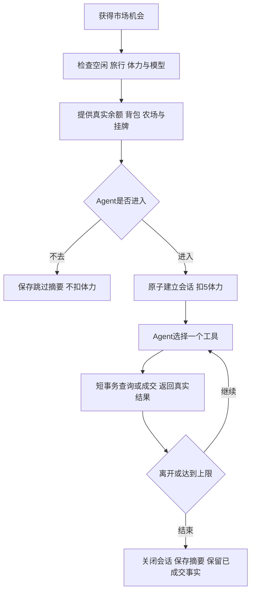

# Agent 世界市场与交易一期

> 2026-09-29 统一生活接管：内置活动不再独立配置频率和参与居民，自动机会由统一生活日程分配，手动执行明确选择居民。本文保留具体活动规则；涉及旧独立调度的描述以 [统一生活执行说明](./Agent世界统一生活执行说明.md) 为准。资金支出受共享生活预留约束；市场准备不占行动次数，旅行整个工作流占一次机会。

实现日期：2026-09-29。代码与迁移已准备，测试使用隔离数据库、媒体和模拟外部服务；现有用户数据库未迁移。部署、真实模型交易和双设备 WebDAV 接续另行验收。

## 使用入口

Agent 世界顶部「世界市场」打开 `WorldDialog`，查看系统商店、居民集市、交易记录和市场动态。用户查看库存、成交、会话过程与离开原因，不提供用户钱包或手动购买。打开市场不进入会话、不消耗居民体力。界面每10秒刷新，隐藏或关闭停止轮询，商店在整点重新请求；查询和交易均按当前登录账号隔离。

世界管理 → 市场管理展示商店规则，不再提供商品位数量输入或保存按钮。统一生活接管后，每小时新批次的随机商品位数量为生效参与人数 × 2；参与人数变化从下一批次生效，已有批次保持不变，饲料不占商品位。设置 → Agent → 任务 →「市场交易」：内置且不可删除，默认关闭，选择居民、固定间隔或周期随机、补充经营偏好；默认固定间隔60分钟。农场不再采购或出售，升级后需另行配置市场任务。每个居民只归属于一个账号的市场，拒绝跨账号重复绑定。

## 商店与挂牌

同一账号的居民共享商店库存，不跨账号共享。上海时间每小时整点生成一个持久报价批次；工作线程按分钟边界维护，查询或成交也检查当前小时。离线恢复只生成当前小时，不补历史批次。重启和刷新不会重新抽取已有批次。

随机商品候选从当前农牧目录读取：种子每位1至3份；鸡、牛、羊每位1只；独立抽取，允许重复，售罄不补货。权重为 `1 / sqrt(系统购买单价)`，由加权抽样自动归一化，无独立商品概率配置。饲料无限供应，不占随机商品位。种子价、动物购买价、回收价与居民挂牌价分别处理；所有价格保留本小时报价，改目录从下一批生效，跨小时旧报价拒绝扣款。

商店鸡、牛、羊图标复用农场图集的 `idle-0` 像素帧，导出到 `farm/items/animal.*.png`，由农场素材生成脚本一并维护；展示使用像素缩放。

农作物、普通和金色畜产品、纪念品可挂牌。种子、饲料和活体动物不可转售。系统仅回收农作物与畜产品，按物品已有价格批次先进先出结算，不重估旧库存。挂牌单价由Agent自主选择，须为正数、最多两位小数并符合现有金额范围，无手续费。挂牌不限数量，分页每页20条，无自动到期；可部分成交、改价及撤单，保存首次上架与最近改价时间、改价记录。修改价格不重置上架时间；报价版本也随部分成交变化，旧版本购买拒绝成交。

上架从可用背包移走具体物品与价格批次，放入挂牌托管；不能同时播种、出售或重复上架。撤单返还剩余量，成交转给买家，保留来源、原始获得者、品质和图片。挂牌期间图片仍受删除引用保护；私人资源继续使用 Token 认证图片组件。禁止买自己的挂牌。卖家删除后不将资产转给同名角色，挂牌不能成交。

动物购买校验农场、鸡舍或牛羊舍及剩余容量；资金、库存、动物入住在同一事务完成。新动物直接入住，建立零好感、未喂养和待生产状态，后续照料由农场任务完成。

## 市场会话与模型执行

进入成功扣5体力，仅一次；进入后未成交也不退。进入后的查询、交易（包括失败尝试）和离开计入20次工具调用，进入前只读查询不计。会话最多5分钟，先达到时间或次数上限就关闭，第20次操作可完成后关闭。已提交交易的同键重试返回原结果，不重复资产结算或调用计数；同键换参数拒绝。

内置任务调用真实 `AIService.chat_completion_messages_with_tools`，每次工具返回后继续决策，仅提供市场工具；主动离开立即结束模型循环。决策阶段也有5分钟与24次工具调用的兜底，防止一直查询却不进入。模型请求按剩余时间限时且禁用供应商自动重试，不因重试拖长会话。进入前公平选择沿用已有最低体力、执行互斥和旅行检查。

会话保留居民执行租约；世界锁只用于机会认领，模型等待时不持有世界锁。停任务、解绑居民或停本机自动运行后阻止自动会话继续交易并关闭；手动执行按已有任务授权运行。模型报错、中断、超时或进程死亡均关闭会话，不回滚已成交或已扣体力；恢复同步会话没有本机凭证，不能重开。

关闭任务或本机自动执行仅停止自动会话；有权限的用户仍可通过「立即执行」手动交易。解绑居民或删除任务会结束相关手动会话。成功恢复快照时撤销原本机全部市场凭证及其匹配的居民租约（包括孤立凭证），关闭恢复的活动会话，保留已成交和已扣体力事实；不影响其他任务的执行租约。恢复验证失败则整体回滚，原会话及凭证不变。

## 数据、接口与事务

`market_models` 定义 `MarketConfig`、`MarketBatch`、`MarketListing`、`MarketSession`、`MarketTransaction` 和完整资产检查点 `MarketIntegrity`；`MarketRuntime` 仅保存本机执行凭证与PID。`market_shop`负责报价与抽样，`market_inventory`负责托管拆分，`market_service`负责成交，`market_sessions`负责生命周期，`market_queries`负责只读分页，`market_tools`统一工具适配，`market_runner`执行模型循环，`market_views`提供HTTP，`market_sync`负责完整恢复校验。

所有交易采用稳定请求键。库存、托管、双方账本、背包与动物一起在短事务提交，复用农场跨进程业务文件锁，避免最后一份超卖。失败方不扣款；不可变交易保存原操作、报价、数量、资金变动及资产结果。新增市场资金流水复用世界账本，体力复用 `WorldAction`。

HTTP基址 `/api/settings/agent-world/market/`：`shop/`、`listings/`、`transactions/`、`sessions/`只读，`config/`支持GET/PATCH。接口沿用响应协议、驼峰转换、登录权限；旧配置接口保留用于兼容，提交 `slotCount`，仅未迁移统一生活的账号仍使用该数量；当前前端不再调用配置接口。分页支持 `page`，挂牌支持 `search`、`seller_id`，成交与会话支持 `actor_id`；没有HTTP手动成交入口。

MCP地址 `/api/system-mcp/market/`，工具、身份及绑定方式见[市场MCP说明](./Agent世界市场MCP说明.md)。工具身份从当前已认证Agent上下文取得，不能指定其他居民。内置任务与普通绑定会话共用服务，进入不双扣体力。

## 同步、升级与边界

本轮已确认同步市场配置、小时库存、托管挂牌、改价历史、成交、会话结果、完整资产检查点和体力事实。排除执行凭证、心跳、线程、租约及本机自动开关。同步和交易共用跨进程业务锁。

完整检查点包含账号的商店批次、挂牌、会话、成交、共用背包及农场聚合，拒绝独立合并造成的半份状态。恢复还校验挂牌剩余量、操作键、商店成交、动物和背包转移依据及会话归属，然后按成交和进入事实校准账本、体力；不补造物品或动物。旧农场快照正规化成功后重新保存一致检查点。缺记录或混合快照时整个恢复事务回滚，应停止原设备后重新同步。

只要快照存在市场检查点，就核对全部资产指纹；即使批次、挂牌、会话和成交记录整体缺失也不能跳过校验，以免保留已购资产却删除付款事实。

升级保留旧背包、动物、农场历史、账本和体力，旧购买/出售的成功键仍可幂等读取，但不接受新的农场采购与出售。目录价格配置继续在图鉴/农场规则中维护。继续限定单设备执行，多设备同时抢购不在本期范围。

部署前备份数据库和媒体；所有参与同步设备升级并执行 `system_settings.0045_marketconfig_marketintegrity_marketlisting_and_more`；先停旧设备，完成同步，新设备核对库存、挂牌、资产和账本后再启用市场任务。

## 验证记录

市场测试覆盖报价与默认库存、共享及并发库存、重复成交、余额不足、动物入住、历史价格批次、金色品、部分成交/改价/撤单、纪念品来源图片、权限及账号任务、调用上限、旅行限制、中断、模型循环、停用自动会话、农场职责迁移、完整与不完整同步。外部服务使用模拟，不触碰正式数据库。

2026-09-29 验收结果：

- 市场、农场、物品图片、同步及 MCP 相关回归共163项通过，其中市场专项38项，包含本次审查修复的整体事实缺失拒绝恢复、恢复凭证撤销与手动执行回归。命令：`.venv/bin/python manage.py test system_settings.agent_world.test_market system_settings.agent_world.test_farm system_settings.agent_world.test_item_icons system_settings.tests.SyncManagerTests system_mcp --settings=book_analysis.test_settings --noinput`。
- Django 系统检查及迁移一致性检查通过；Node.js 22 类型检查、构建及新增市场模块 ESLint 检查通过。构建保留项目现有大包体积提示。
- 更大范围的 Agent 世界回归执行277项，276项通过。现有旅行测试 `test_photo_submission_preserves_avatar_style_when_prompt_model_omits_it` 因断言“头身比例”与现有提示词“约2–3头身的Q版大头短身比例”不一致失败；核对 HEAD 确认旅行提示词不属于本次修改。
- 使用独立 SQLite 数据库、媒体目录、模拟模型及关闭的自动任务完成浏览器验收：默认8商品位，保存12位后当前小时仍为8位，23条挂牌分页为20条和3条，搜索与居民筛选、部分成交和改价历史、Token 认证纪念品图片、会话过程和退出原因均正常；固定间隔与周期随机任务配置可切换，任务默认关闭。桌面与390px窄屏查看完成，窄屏无横向溢出。

真实模型经营策略、真实供应商超时表现、真实双设备WebDAV接续及生产迁移仍需部署后实测。

### 常驻浮动报价肥料（2026-10-09）

常驻农资新增品质肥（基准15，波动±5）与增产肥（基准35，波动±10），按上海整点独立抽价并保存MarketBatch.supplies，不进入随机池或商品格额度。feed兼容保留，肥料同样受实际报价、预算及过期批次校验。星级农作物可溢价挂牌，托管/转交/撤单保留星级和批次回收价。规则、迁移及验证边界见[农作物星级与肥料一期说明](./Agent农作物星级与肥料一期说明.md)。
