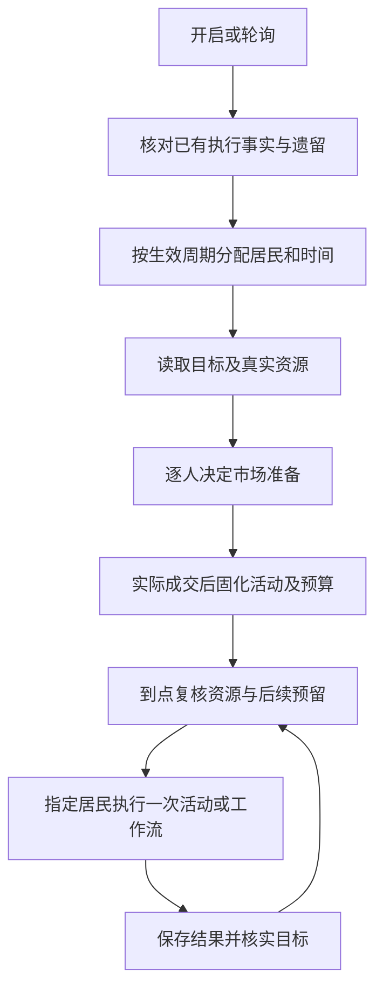
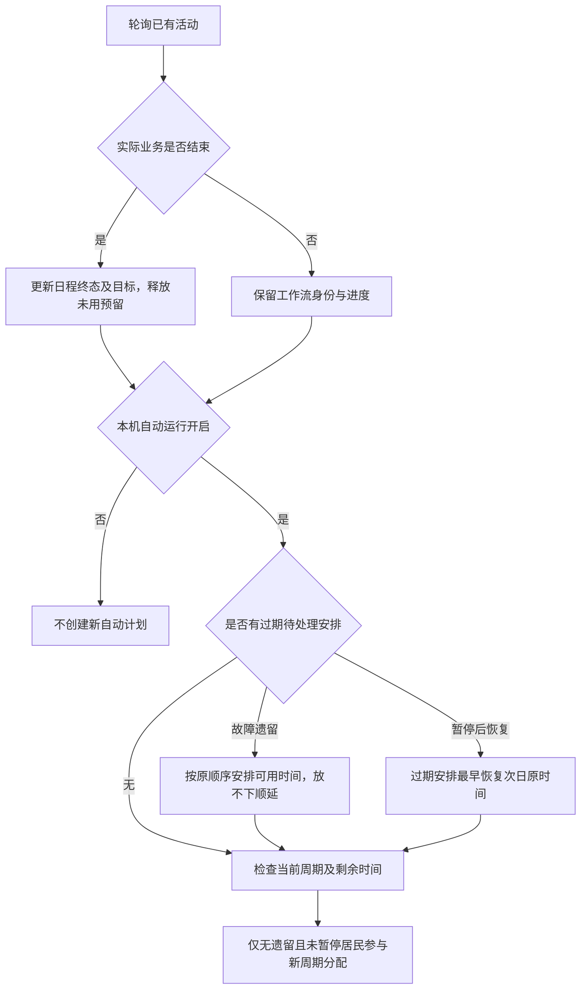
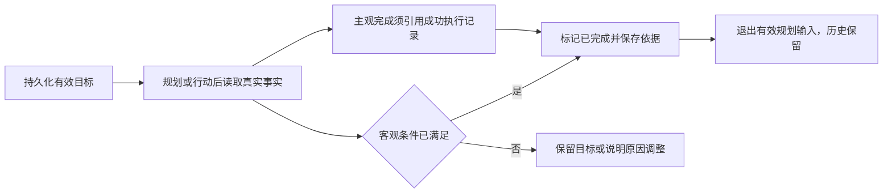
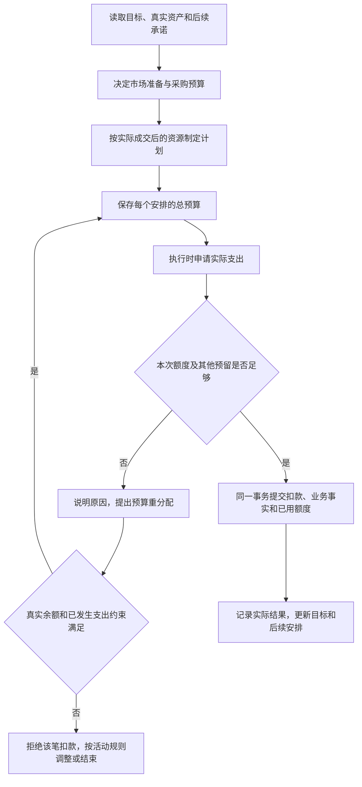
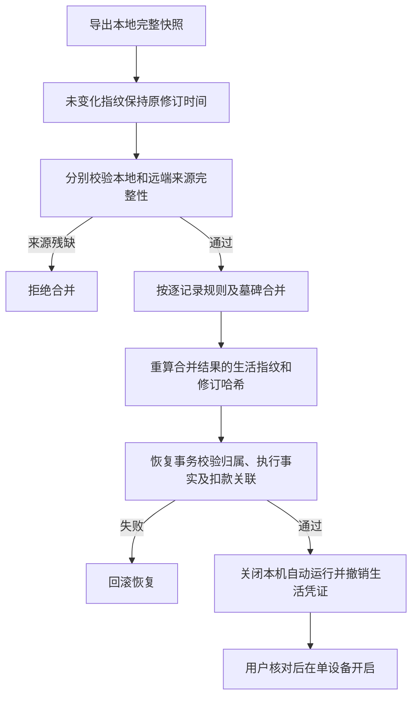

# Agent 世界统一生活规划与执行

更新时间：2026-09-30。本文描述统一生活入口的代码行为；数据库迁移、真实模型及双设备 WebDAV 接续分别验收。

## 1. 入口与执行流程

系统设置 → Agent →「统一生活运行」配置参与居民、固定间隔或自然日／周／月／年总次数、活动时间、居民最小间隔和补充规划最少剩余时间。Agent 世界 →「生活日程」查看周日程、列表、预算、调整历史，以及编辑居民偏好与目标。

内置卡片配置评论、发帖、旅行、农场、市场和投资能力，不再独立分配居民或时间。手动执行明确选择居民。普通自定义任务保留原调度，其确定安排与实际执行记录进入生活上下文。



计划不会提前创建成交、出发或消耗体力。模型提议，服务端验证身份、活动、预算与实际支出。新的时间表采用稳定 ID，刷新或重启不重新抽签。

主图描述自动运行路径。自动开关关闭时，手动旅行仍可推进，并核对已结束的业务事实、释放未用预算；此时不创建新的自动生活计划。

## 2. 次数、周期与恢复

- 使用上海时间。固定间隔为每日活动窗口的固定网格；60 分钟全天对应 24 个世界机会。周期次数按时间分段随机，不集中生成。
- 12 次分给 4 人各 3 次；13 次本周期随机一人多一次，余数不跨周期累计。休息、观望和明确失败均消费机会。
- 参与居民及节奏从下次周期生效；暂停立即阻止新执行和费用提交。长周期提前生成全部时间点，活动意向分批规划，每天按资源修订当天安排。
- 默认同一居民最小间隔 15 分钟，新周期规划至少剩余 4 小时。22 点启动不压缩全天次数；容量不足返回明确错误。固定间隔补充只保留窗口内尚未到来的网格点。
- 遗留居民不参加新周期分配，其他居民正常分配。故障遗留按顺序挪到可容纳时间，不集中补跑；暂停后恢复，过期安排最早挪到恢复次日的原时间。未来安排保持时间。
- 同一安排最多三次暂时忙碌／体力不足顺延；持续不可执行结束并保留原因。规划输出持续无效也有重试上限。旅行节点沿用现有重试机制，需人工介入的工作流可在旅行面板继续，或在生活详情说明原因取消，已发生扣款不退款。

### 遗留恢复与开关边界



暂停／恢复操作会立即检查对应居民的安排；正在执行的工作流核对实际进度，不重新整段执行。未来正常安排不作为过期机会重排。

## 3. 共享上下文和目标

输入包括居民性格、职业、偏好、生活方向、有效目标、真实现金和体力、背包与农场、持仓、在途旅行、近期真实执行、今天已做事项及后续计划。记录按上限截取，市场列表及日程支持分页；缺失资源返回空值。

目标分为进行中、暂停、已完成和已放弃，保存进展与原因，不要求完成日期。现金、库存及旅行目标根据实际数据检查；居民自行完成主观目标须引用成功执行记录。已完成和已放弃不再进入有效目标输入，历史继续保存。人工管理目标也可明确修改状态并说明原因。



## 4. 市场与预算

每日市场准备不占行动次数，同一居民同一天用稳定身份，重启不重复整套准备。市场会话仍允许自由买入、上架、出售、改价及主动离开，沿用调用数和时限。缺货后按照真实库存规划，中途补给使用原行动预算且刷新执行上下文。

每小时新商店批次商品格数为生效参与人数 × 2。每位居民在一个批次内最多选两个商品格；重复 SKU 的不同格分别计额度，已选格可继续买剩余库存。跨会话由实际成交记录累计校验。饲料不占格额度但仍扣款，居民挂牌不受该格额度限制。人数变化不改写已经生成的批次；历史批次不变。

预算是共享现金的预留，不是新增余额或提前扣款。每个安排保存总预算与累计已用；其他未结束安排的剩余额度必须保留。扣款、已用额度及业务事实在同一事务提交，投资不能花掉旅行预留。

旅行上下文提供启用目的地的最低、典型及最高实际价格，可选购物另留预算。农场现金预期包含扩地、建筑和升级；种子、动物、饲料由市场购买。超预算可调用 `adjust_life_budget` 或提交农场预算调整；旅行扣费前必要时再次请居民调整后续预算。调整须说明原因，不能低于已支出或突破真实现金。外部手动改动后，下次执行再复核。



预算保护约束已经预留的资金，不保证模型一定安排旅行或保留任意比例现金。当前没有固定投资仓位上限；若其他安排没有预算、居民又选择投入全部可用资金，仍可能接近满仓。这与可自主选择生活活动的设计一致，但不能把“有生活上下文”当作“不再满仓”的保证。

## 5. 模块与接口

| 模块 | 职责 |
| --- | --- |
| `life_models`、`life_config` | 生活配置、资料、目标、周期、安排、调整及归属 |
| `life_schedule`、`life_time` | 上海时间、分配、持久身份、暂停及恢复 |
| `life_context`、`life_planner` | 有界真实上下文、市场准备、活动提议及目标检查 |
| `life_scope`、`life_runner`、`life_manual` | 指定居民、统一触发及兼容手动入口 |
| `life_budget`、`life_travel_budget` | 实际支出保护及可解释重分配 |
| `life_views`、`life_sync`、`life_snapshot` | 账号隔离接口、来源快照校验、合并指纹及恢复关联检查 |

接口前缀 `/api/settings/agent-world/life/`：`config/`、`profiles/<actor>/`、`goals/`、`schedule/`、`schedule/<id>/`。日程支持日期范围、居民、状态和分页；操作支持暂停、恢复、取消与人工重规划。目标选项通过 `goals/?options=1` 获取。前端 API、类型、Hook 和展示组件独立组织，复用 `WorldDialog` 及公共 `Select`。

## 6. 迁移和 WebDAV

迁移为 `0048_unified_life_planning`、`0049_life_snapshot_integrity`、`0050_migrate_world_life_schedule`。将同账号内置任务绑定居民合并为参与列表，跨账号资产冲突报错；初始节奏为默认值，不累加旧任务频率。转换旧随机计划尚未消费的未来时间点，已物化执行与旅行继续核对原业务事实；错过或结束的机会不复活。

升级后本机自动运行关闭。确认迁移结果与统一配置后再开启。旧内置独立机会调度停止；旅行节点推进、自定义任务调度和已提交事务的恢复保留。投资最新已发布收盘数据的修复保留，不改历史成交成本或账本。

同步配置、资料、目标、周期快照、安排时间、预算、结果关联及调整原因。导出时保存各账号生活聚合指纹，恢复核验指纹、归属、执行记录和预算关联，并将实际扣款键对应的账本合计与累计支出核对；缺关键数据拒绝整个事务。本机开关、租约、线程和授权凭证排除同步。恢复会关闭世界执行，新设备核对后人工开启；运行中安排先核对事实，不直接重放。所有同步设备升级后才恢复新快照，仍限定一台设备自动运行。

开发验证使用隔离数据库、模拟模型和模拟 API 浏览器。真实 WebDAV 跨设备接续、实际模型规划质量及部署生效不由静态检查替代。

审查修正：周期内居民按随机确定的顺序轮转，避免轮次交界违反最小间隔；随机落点受限时回退到最早可用点，再判断容量。自动运行关闭时仍核对已执行活动的终态，手动旅行完成后释放未用预算，不触发新规划。同步先校验两端来源，再重算合法合并结果的生活指纹；相同内容的重复导出不产生新修订。




## 7. 本次验收与启用步骤

- 首轮实现验证：31 项统一生活场景，连同市场、农场、旅行、投资、评论、自定义随机任务和快照恢复共 283 项测试通过；模拟模型及外部失败，不调用真实交易或搜索。
- 2026-09-30 审查修正验证：统一生活、快照同步与旅行相关测试共 131 项通过，覆盖重复导出、两端独立目标合并、残缺来源拒绝、关闭自动运行后的旅行收尾、连续 30 天可行时间分配。该数字为本轮相关范围，不与首轮数量累加。
- Node 22.14.0：类型检查与构建通过。构建仍有现有大包体积提示。
- 隔离 Chrome 与模拟 API：实际检查统一配置保存、周日程／列表、预算详情、目标新增、空日程、错误提示及 390px 窄屏。
- 未执行：实际用户数据库迁移、生产部署、真实模型行为、真实 WebDAV 双设备接续。

启用时先备份数据，停止旧自动执行，更新所有同步端，使用项目 Python 运行 `manage.py migrate` 应用0048–0050，再重启后端并发布前端。系统设置中检查转换安排、参与居民及节奏；确认遗留事实后开启本机生活运行。旧设备停止并同步后，才在新设备开启。

回归命令：

```bash
.venv/bin/python manage.py test system_settings.agent_world.test_life system_settings.agent_world.test_market system_settings.agent_world.test_farm system_settings.agent_world.test_travel system_settings.test_agent_world system_settings.agent_world.test_investment system_settings.agent_world.test_farm_bonus system_settings.tests.SyncManagerTests system_settings.test_agent_random_schedule --settings=book_analysis.test_settings --noinput
cd frontend_react
npm run type-check
npm run build
```

## 8. 与讨论预期的对应及当前边界

| 已确认约定 | 当前对应 |
| --- | --- |
| 一个入口统一分配，任务只提供能力 | 世界配置、周期及指定居民执行；自定义任务保留原调度 |
| 公平分配机会，余数随机且不跨天补齐 | 周期内随机顺序轮转，时间及居民身份持久化 |
| 能理解过去、现在、接下来的生活 | 共享角色、资源、有效目标、近期结果和后续安排上下文 |
| 买到物资后规划，超预算可以调整 | 市场准备与实际资源刷新、说明原因后调整预留、实际扣款事务校验 |
| 完成远期目标后不再反复规划 | 持久化目标状态，完成与放弃退出有效输入，历史保留 |
| 重启不重抽、不重复消费、遗留优先 | 稳定安排身份、原业务事实接续、故障及暂停分别恢复 |
| 日程和持久资料同步，本机授权不随同步开启 | 日程界面、来源及恢复校验、本机执行状态排除同步 |

主要业务链路已按上述约定接入，但不能据此宣布所有规模和真实运行场景均已验收。当前模型上下文最多带 20 个有效目标、50 个后续安排、20 条近期执行、100 条背包记录；有总量提示，界面有分页，但模型尚无对应的全量分页读取或自动摘要能力。长周期每批最多规划 50 个安排，不能将它理解为一次模型调用已经完整理解全年计划。这是与最初“长记录摘要和分页”要求之间仍需补齐的范围。

真实模型能否合理安排预算、是否频繁改变意向、真实 WebDAV 双设备接续及部署后的实际行为，仍需单独验收。模型自主选择的质量与服务器预算、身份、幂等约束应分别观察。
