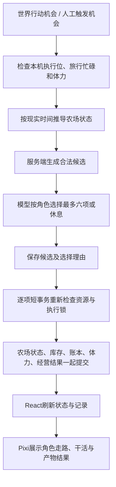

# Agent 像素农牧场一期说明

实现日期：2026-09-29。代码、迁移、像素素材与本地验收已准备；生产部署、真实模型经营与真实双设备 WebDAV 联调另行验收。

## 入口与控制

Agent 世界 → 像素农场模态卡片，打开、切换居民和关闭均不改变当前页面地址。设置 → Agent → 任务 → 农场经营：配置参与居民、周期随机或固定间隔及补充经营偏好，启用任务后为每个居民创建独立农场和四块免费耕地。默认固定间隔 30 分钟，首次配置前关闭且不创建数据。

用户只观看经营，选择角色外观、修改目录、控制任务开关；不提供直接播种、喂养、购买或收获按钮。任务卡片“立即执行”仅触发一次 Agent 决策，不代替它选择经营操作。自动运行受已有“在本机自动执行系统任务”开关控制，关闭不会补跑离线机会。旅行、发帖、评论与农场共享 Agent 执行锁和体力。

农场持有当前 Agent 稳定 ID，改名不会改变归属。居民删除后保留农场、库存、经营历史与账目，不将同名新居民绑定到历史资产。

## 规则

所有金额为世界虚拟货币，农场直接使用现有余额，不额外限制预算。每项成功操作消耗 2 点体力，失败和休息不消耗；一次照料最多四块地或四只动物算一项操作。

| 作物 | 有效生长时间 | 种子价 | 产量 | 单个回收价 |
| --- | --- | --- | --- | --- |
| 萝卜 | 1 小时 | 10 | 1 | 18 |
| 土豆 | 2 小时 | 20 | 2 | 18 |
| 玉米 | 4 小时 | 35 | 3 | 20 |

初始四块田；按固定位置扩展至 8、12、16 块，依次支付 500、1000、2000。浇水保湿 24 小时，缺水暂停生长。世界天气使用同步种子和上海时间六小时区间计算，晴天70%、雨天30%；降雨期间湿润，雨停再保湿24小时。晴天不加速，昼夜只改变画面。成熟等待收获，不腐烂。

| 动物 | 有效生产时间 | 购买价 | 普通回收价 |
| --- | --- | --- | --- |
| 鸡 | 24 小时 | 150 | 鸡蛋30 |
| 牛 | 48 小时 | 600 | 牛奶100 |
| 羊 | 48 小时 | 500 | 羊毛90 |

饲料每份5，一只动物覆盖24小时，不累计超过24小时；提前补料仍消耗一份，仅补足至本次喂养后24小时。无饲料暂停生产，不死亡、不掉好感。上海自然日内首次成功喂养增加半心，最高五心，十天可满心。动物最多保留一轮待领取产物，领取后从当前时间开始下一轮，不补算等待领取期间的生产。

低于五心：双产概率=心数×10%，半心对应5%，其他为一个普通品。五心：50%两个普通品、40%一个普通品、10%一个金色品，互斥抽取。周期完成时记录好感快照和确定性抽取结果，重试、刷新、换设备不重抽。金色回收价三倍，单独SKU与像素图标。

| 建筑 | 建造价／容量 | 升二级／容量 | 升三级／容量 |
| --- | --- | --- | --- |
| 鸡舍 | 300／2 | 600／4 | 1200／6 |
| 牛羊舍 | 800／2合计 | 1600／4合计 | 3200／6合计 |

建筑位置固定，升级立即改变容量与外观，不加速生产。首版不做繁殖、拆除、加工、自由摆放或其他居民交易，农场主职业暂不额外加成。

目录在农场配置弹窗编辑。进行中的作物和动物周期保存规则快照，后续周期使用新规则；收获产物的回收价格保存到库存批次，出售按先进先出批次结算，不因目录变更重估已有库存。

## 模型、服务端与画面边界

模型只能选择本次候选ID，不能自由指定金额、产量或状态。候选来自机会开始时的真实状态；需要前置购买或建造才能执行的操作在后续机会开放。一次正常决策调用模型一次，格式错误最多修正一次。每个子操作独立原子提交，后续条件失效则停止剩余计划，保留之前已提交事实。崩溃恢复关闭原机会并补齐状态展示，不重做模型决策或重复扣费。

`AgentFarm` 保存完整农场聚合：地块、建筑、动物、生产周期、版本、最后操作及已接受操作键。`FarmOperation` 保存不可变经营结果。体力使用稳定子操作键对应的 `WorldAction` 成功事件，余额使用 `WorldLedger`，背包使用原有 `AgentInventoryItem`；不另建余额或背包。

时间推进由本机执行器完成，不调用模型；任务暂停后已承诺的生长仍继续。GET接口只按服务端时间推导展示，不写入库存或收益。关闭本机执行器后展示仍可推导自然时间，持久周期结果在下次业务时钟或领取事务推进时保存。领取始终重新计算并确认唯一结果。

角色/动物移动是演出，不能决定生产或扣款。页面首次打开不补播历史操作，仅对打开后观察到的新成功结果演出；15秒刷新可能合并一轮多个快速操作，场景演出最后观察到的操作，完整操作均保留在经营记录。雨滴、动物散步和实时坐标不持久化。页面隐藏或减少动态效果时停止逐帧演出；恢复后依据最新状态展示。

## 接口及素材

- `GET /api/settings/agent-world/farms/`：当前用户的农场列表。
- `GET /api/settings/agent-world/farms/<agent_id>/`：服务端时间、状态版本、天气、余额、当前动作、农场及背包。
- `PATCH`同路径：仅接受像素外观`appearance`，`style`和`palette`范围0–3。
- `GET .../<agent_id>/history/`：最近100项经营结果。
- `GET/PATCH /api/settings/agent-world/farm-catalog/`：当前世界目录；PATCH提交完整`rules`。
- 原任务接口新增`taskKind=farm`及服务端生成的`farmConfig.ownerId`。内置任务固定ID `builtin-farm`，不可删除。

前后端沿用项目的驼峰转换和`code/msg/data`协议。详情、外观和历史由用户归属检查保护，页面不开放经营写接口。农场每15秒更新，隐藏停止轮询，切居民取消旧请求；场景失败仍保留状态列表和重试。

原生PixiJS8按路由加载。32×32角色：四套预制形象、四套配色、四方向四帧走路和四种干活动作。鸡牛羊各有待机、走动、进食；作物三阶段，建筑三级。固定网格A*避开建筑及池塘，动物在围栏内活动。素材为项目原创程序绘制，可执行 ` .venv/bin/python scripts/generate_farm_sprites.py` 重建577帧图集和物品图标。开发路径`/farm/`，生产使用Vite基础路径`/static/farm/`。

## 同步、升级与验证边界

`AgentFarm`、`FarmCatalog`、`FarmOperation`、农场任务配置、经营体力事实、库存与账本全部进入WebDAV快照；外观属于持久配置。目录种子同步，内置素材随应用版本发布。本机锁、线程、运行开关、寻路、粒子和动物实时位置不同步。

同步导入、导出及农场写入共用本机可重入文件锁，跨进程互斥。恢复以胜出的完整农场为依据校准流水和体力，删除不属于该农场接受链的经营投影；共用背包按原有 `AgentInventoryItem` 快照恢复，不用农场库存快照覆盖市场等来源的物品；缺失目录或经营结果拒绝恢复不完整快照并回滚。恢复后沿用账本重算余额。该机制不提供跨设备实时互斥。

切设备流程：停旧设备本机执行 → 同步完成 → 新设备同步并核对 → 开启新设备执行。两个设备同时经营不属于首版支持范围。

迁移为 `system_settings.0044`，部署前备份数据库，所有同步设备升级并执行迁移，再启用农场。本地测试数据库用于浏览器验收，不将示例农场或示例账号写入现有用户数据库。生产真实模型经营、真实WebDAV双设备接续仍需实际联调。

已完成本地验证：后端169项回归（含29项农场测试及背包图标回归）、前端类型检查及生产构建、农场模块ESLint、5项前端逻辑测试。隔离数据库的真实浏览器验证覆盖像素地图、雨晴、角色行动及动物移动、地块详情、外观保存、390px窄屏与场景退出重建。现有用户数据库存在多项先前版本的未执行迁移，因此本次仅在隔离数据库验证迁移，未修改现有用户数据库。

评审修复：农场复用 `AIService.chat_completion_messages` 并按字符串解析，始终指定居民模型；经营输入只包含当前地块、建筑、动物、库存摘要及候选，不传审计操作链或库存恢复快照。建筑目录三级容量必须严格递增；修改目录后，升级仍须扩大已建建筑容量并容纳现有动物，否则不会进入合法候选，事务也拒绝扣款。新增回归覆盖真实AI适配器（仅模拟网络客户端）、一次格式修正、10000条审计记录不扩大决策输入，以及修改目录后升级失败的账本、体力与状态一致性。

## 共用角色背包与模态入口

农场在 Agent 世界的 `WorldDialog` 模态卡片中按需加载，关闭卸载场景并停止轮询。卡片不单独展示农场背包；“打开背包”与居民属性复用 `AgentInventoryDialog`、`useAgentInventory` 和同一库存接口，显示该角色持有的全部物品。

农资、作物、畜牧产物与其他来源物品共用 `AgentInventoryItem`。经营根据角色、所属账号和 `source.sku` 检索，不根据 `kind`、农场 ID 或物品 ID 前缀限制来源；不同记录 ID 的相同 SKU 数量合计，消费按获得时间及记录内价格批次先入先出，同类新增物品优先堆叠到已有记录。未来市场写入相同 SKU 的角色库存，即可用于播种、喂养或出售；市场交易本身仍未实现。账号权限和不同角色的资产归属继续保留。

共用库存读写放在 `inventory_stock.py`，新增库存无需属于农场。背包通过通用同步数据恢复，农场不再维护独立库存投影；旧 `inventory_snapshot` 在自然推进、经营提交或同步恢复时清理，不覆盖共用物品。新增测试覆盖其他来源种子、多记录库存数量、跨记录出售、同类堆叠、权限边界及恢复时保留共用背包。

本次模态入口浏览器验证：打开及关闭农场保持 `/agent-world`，关闭后画布移除且页面滚动恢复；农场入口与居民属性入口展示相同背包物品及数量；内置种子、作物与饲料图标正常加载；820px窄屏无横向溢出，配置弹窗覆盖在农场卡片上方且关闭配置后保留农场。相关类型检查、ESLint及生产构建通过；169项后端回归通过。

### 物品图鉴入口

Agent 世界顶部“物品图鉴”打开只读模态卡片，支持名称／SKU 搜索，按纪念品、种子、饲料、农作物、畜产品及其他分类。`GET /api/settings/agent-world/item-catalog/` 返回当前农牧目录（含普通与金色产物），并汇总当前用户所有居民共用背包的持有数量；无 SKU 的纪念品按名称、品质及目的地归类。纪念品展示范围为当前背包，不代表永久收集历史。目录价格反映当前配置，已有周期仍使用规则快照。此功能不新建表、持久字段或收集进度，派生响应及临时筛选状态不参与 WebDAV 同步。
