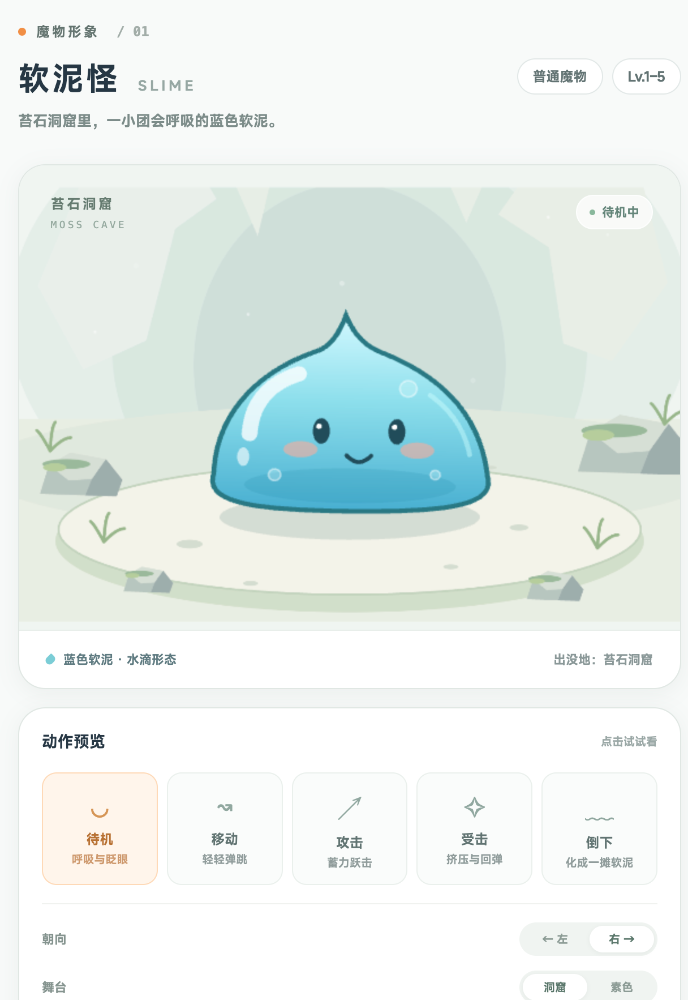

# Agent 魔物形象与战斗动画设计规范

本规范以用户已确认的软泥怪 PixiJS 形象、苔石洞窟背景和独立预览页为首个基准。后续魔物逐只制作，沿用同一套视觉语言与验收流程：**先制作独立预览，确认形象和动作，再接入图鉴；战斗场景复用角色与背景，技能效果单独设计。**

适用范围：魔物静态缩略图、PixiJS 角色、出没地背景、动作预览、技能特效及未来战斗场景。页面与组件仍须遵循[代码规范](../代码规范文档.md)和[UI 设计规范](../UI设计规范文档.md)。本规范不改变战斗数值或目录内容。

## 1. 已确认的基准与当前接入范围

| 内容 | 当前状态 |
| --- | --- |
| 软泥怪 `monster.slime` | 形象、五个基础动作和预览页已确认 |
| 苔石洞窟 `dungeon.moss_cave` | 背景已确认，预览与图鉴共用同一素材 |
| 怪物图鉴 | 列表使用静态形象；软泥怪详情使用待机动画；同洞窟怪物与首领复用背景 |
| 独立预览 | 已保存 HTML、TypeScript、CSS 和角色源码，可在本地重新启动 |
| 正式战斗动画 | 尚未接入探索观察界面；可复用角色，但需新增事件播放与场景编排 |
| 各技能战斗特效 | 尚未建立通用实现；当前预览中的落地波纹和水滴是动作样例 |

已确认的预览页面参考图保存在仓库中，避免依赖临时附件或聊天记录：



参考图用于核对风格；交互和动画以保存的源码运行结果为准。

## 2. 魔物视觉语言

### 2.1 轮廓、比例与表情

- 使用柔和、圆润、简洁的二维矢量绘制。优先用 PixiJS `Graphics`、渐变和分层容器实现可变形角色，不引入另一套像素或写实风格。
- 先保证剪影可识别：每只魔物有明确的主体形状，以及少量能区分物种的特征。蝙蝠可强调翅膀，岩石兽可强调石块与苔藓；不要求其他物种也做成水滴形。
- 角色主体占主要视觉面积，五官紧凑、表情清楚。以圆眼、小高光、简单嘴形为起点，表情可随性格和物种变化。
- 轮廓线用角色主色对应的深色，保持圆润的端点与连接。软泥怪参考绘制宽度约 228、轮廓线宽 4 个设计单位；其他角色按体型维持相近的视觉线重。
- 首领和精英通过体型、轮廓、装饰或动作气势增强辨识度，不仅靠更换颜色或添加品质角标区分。

### 2.2 配色、材质与光照

每只魔物使用一组主色、较深轮廓色和少量辅助色。主体比背景更鲜明；背景保持低饱和度。允许不同物种拥有自己的色相，整体保持清爽、可爱、略带幻想感。

| 软泥怪基准 | 色值或参数 | 用途 |
| --- | --- | --- |
| 主体渐变 | `#d2f9ff` → `#8ddfec` → `#48afd1` | 上亮下深，中间色位置约 44% |
| 轮廓 | `#287883` | 与蓝色主体协调的深色边线 |
| 五官 | `#204c59` | 保持缩略图中的对比度 |
| 腮红 | `#f6ad9e`，约 62% 不透明度 | 局部柔和点缀 |
| 高光 | 白色与浅青，局部半透明 | 左上方主光源、少量反光与气泡 |
| 投影 | `#356663`，约 16% 不透明度 | 椭圆落地阴影 |

软泥怪的透明感由高光、气泡和渐变表达，主体保持完整的蓝色。半透明只用于有意设计的局部层。**图鉴缩略图与详情必须采用同一配色，不因“尚未遭遇”降低整张卡片的不透明度或加灰度滤镜。** 探索状态使用文字和角标表达。

光照默认从左上方进入；阴影落在角色脚下，随离地高度缩小、变淡。岩石、毛皮等材质使用同样的线条与光照语言，但无需复用软泥的透明材质。

### 2.3 静态资源与动态形象一致

- 静态缩略图使用清晰的中性待机姿态，轮廓、色值、五官位置与动态角色一致。
- 角色素材不嵌入出没地背景、名称、等级、状态角标或血条；这些由场景和 UI 负责。
- 图鉴列表使用轻量静态资源，详情按需加载动画；避免每张列表卡片都创建一个 WebGL 上下文。
- 加载动画或 WebGL 不可用时保留静态角色，背景也应继续显示。

## 3. 出没地背景与构图

- 背景按稳定地牢 ID 关联，通过目录中的怪物分布与首领关系查找。不要以中文名称作为资源键，也不要将背景绑定为某只魔物的专属素材。
- 同一怪物有多个出没地时，图鉴按目录中的怪物分布关系顺序选择首个已注册背景，再考虑首领关联；出没地文本仍完整显示。独立预览可指定正在设计的区域，正式战斗使用实际进入的地牢，不沿用图鉴的默认选择。
- 苔石洞窟统一使用 `frontend_react/src/assets/combat/moss-cave.svg`。洞穴蝙蝠、苔石兽、苔冠巨兽以及后续同区域魔物复用这一份背景。
- 保留洞口层次、浅绿灰色石壁、苔藓、少量草叶与岩石、椭圆落脚平台。背景细节用于交代环境，角色面部和行动区域保持干净。
- 背景、角色、落地阴影与技能特效独立分层。角色脚底锚点为 `(0, 0)`，场景负责站位和缩放，角色负责内部绘制与形变。
- 当前洞窟展示参考设计空间为 `640 × 420`，角色脚底位于画面高度约 74%；软泥怪预览缩放为 1.15。后续体型不同的魔物可调整展示缩放以完整呈现轮廓。
- 图鉴详情保持主体居中，名称和出没地置于场景下方；战斗场景可沿用同一背景素材，但需重新安排双方站位、交战距离和技能空间，不能直接照搬单角色居中构图。
- 无已设计背景的区域保留现有简洁展示；新区域另行设计、确认并注册背景，不使用苔石洞窟代替全部区域。

## 4. 基础动作规范

每只魔物先完成 `idle / move / attack / hit / defeat` 五个动作。共用动作语义，各物种可以有不同表现，不复制软泥怪的所有运动方式。

| 动作 | 表现要求 | 软泥怪基准 |
| --- | --- | --- |
| 待机 `idle` | 有生命感，幅度轻微，长期播放不干扰阅读 | 呼吸约 ±2.5% 形变、小幅摇晃、周期眨眼、气泡浮动 |
| 移动 `move` | 明确区分移动与待机，阴影与落脚协调 | 弹跳、离地、回弹；角色场景位移与内部形变分开 |
| 攻击 `attack` | 蓄力 → 出手 → 命中表现 → 恢复，有清楚的节奏 | 下蹲、跃击、落地波纹与水滴；约 1.3 秒结束 |
| 受击 `hit` | 接触瞬间有反馈，随后恢复；不遮住角色辨识特征 | 挤压、后退、闭眼、短暂闪白；约 0.85 秒结束 |
| 倒下 `defeat` | 有完成态，播放结束后保持；不得自动恢复成活着的状态 | 逐渐摊平；约 1.5 秒达到终态 |

上述时长是首个角色的参考，不是所有物种的固定数值。待机与移动可循环，攻击和受击结束后返回待机，倒下需明确的重置或下一场事件才能恢复。

动作采样只依赖动作类型、本地经过时间与朝向，避免按帧数推进造成不同设备速度不一致。允许重复播放、暂停、恢复和左右朝向切换。大动作采用预备、运动和恢复阶段，通过形变与节奏表达重量，而非叠加大量闪烁。

左右朝向采用 `-1 / 1`；尽量通过五官朝向和运动方向处理，避免直接镜像整个角色导致左上光源反转。特殊不对称角色可设计单独朝向，仍保持光照一致。

## 5. 独立预览页作为后续制作模板

### 5.1 固定保留的页面设计

沿用当前软泥怪预览页的浅色底、大圆角场景卡、白色控制卡、柔和边框、克制阴影和橙色选中态。桌面使用场景与控制双栏，窄屏上下排列；内容保持以下顺序：

1. 标题区：制作序号、魔物中文名、可选英文名、简短性格或形态描述、品质与等级范围。
2. 场景卡：出没地标题、当前播放状态、角色与背景；底部显示形态描述和出没地。
3. 动作卡：五个基础动作、动作说明、当前选中状态。
4. 调节区：左右朝向、出没地/素色舞台切换、图鉴尺寸、暂停与继续。
5. 后续有技能的角色增加独立技能预览区，保留基础动作区，不能把全部技能塞进一个“攻击”按钮。

当前预览页的样式参考值如下，后续适配体型或屏幕时保留这些视觉关系；具体实现以 `slimePreview.css` 为基准：

| 项目 | 当前基准 |
| --- | --- |
| 字体与主文本 | MiSans，`#263744` |
| 页面底色 / 场景底色 | `#f8faf9` / `#f0f5f1` |
| 卡片 | 白色，边框 `#e0e7e3`，圆角 24px，轻阴影 |
| 桌面排版 | 最大宽度 1176px，控制栏 288px，栏间距 20px，场景高 470px |
| 动作选中态 | 底色 `#fff5eb`，边框 `#fed9b7`，文字 `#b87233` |
| 强调色 | 标题小圆点 `#f28f45`；不大面积铺满橙色 |
| 宽度 ≤840px | 场景与控制上下排列，五个动作横向排列，场景高 410px |
| 宽度 ≤480px | 卡片圆角 20px，场景高 330px，收紧字号与间距 |

数字 1–5 切换基础动作，空格暂停；输入框中编辑时不触发快捷键。控制须能触控使用，不仅依赖悬停。禁止原生下拉框、可拉伸文本域和可见内部原生滚动条。

新角色优先复用现有排版与控件设计。第二只角色制作时再根据真实共用部分抽取预览组件，避免提前搭建没有使用者的通用框架；软泥怪预览入口始终保留作为回归基准。

### 5.2 保存与重新打开

现有页面不是只存在于临时浏览器中的截图，源码入口为：

- `frontend_react/slime-preview.html`
- `frontend_react/src/previews/slimePreview.ts`
- `frontend_react/src/previews/slimePreview.css`

从仓库根目录启动已有前端开发服务：

```sh
cd frontend_react
nvm use 22
npm run dev
```

按当前 Vite 配置，默认访问 `http://127.0.0.1:43127/slime-preview.html`。2026-10-11 本轮制作时单独启动的预览地址为 `http://127.0.0.1:43131/slime-preview.html`；这是当次本机服务地址，不代表服务永久在线。服务仍在运行时可以直接打开，不必重复启动。端口被占用时先检查已有服务，或显式选择另一个本机端口。

源码保存与服务是否运行是两回事：服务停止后可重新启动，角色与页面不会丢失。必须通过开发服务访问，以加载 TypeScript 模块和素材。该独立 HTML 目前不在默认生产构建入口中，生产应用复用的是已接入图鉴的角色模块。

后续预览入口可采用 `<monster>-preview.html`，每只角色记录稳定目录 ID、资源入口和确认状态。所有正式源码与资源保存进仓库目录；临时运行地址和聊天附件不能作为唯一保存位置。

## 6. 逐只制作与确认流程

1. **读取目录与规范**：确认魔物 ID、物种、品质、等级、出没地、已存在的技能和战斗规则；先查本规范与相关源码。
2. **制作独立预览**：完成主体形象、静态缩略图、五个基础动作及已有背景关联；不在用户确认前替换正式图鉴形象。
3. **提交可操作的预览**：提供页面入口，让用户检查大尺寸、图鉴尺寸、朝向和动作；配合截图说明本只魔物的特点与待确认项。
4. **确认后接入图鉴**：用户明确确认形象与动作后，列表更新静态形象，详情接入待机动画与出没地背景；保留未完成魔物的原有图标。
5. **设计技能表现**：有技能的魔物在同一预览页展示对应技能。角色形象确认不等于技能特效已经确认；技能效果可以随后逐个补齐、确认。
6. **接入战斗场景**：角色、背景和已确认特效接入事件播放层，验证真实事件、重复请求和暂停/继续，不将预览的演示动作作为战斗事实。
7. **记录结果**：更新[角色资源索引与验收记录](./Agent魔物形象资源索引.md)及预览说明；新增角色独立资源，避免覆盖已确认角色和共用背景。索引统一记录资源路径与确认状态，验收详情写在该文件对应角色的小节中。

软泥怪及苔石洞窟已通过形象确认与图鉴接入阶段，不需重复确认同一版本。以后改变已确认的造型、主配色或背景，应重新展示变化。

## 7. 技能效果的设计方式

### 7.1 角色动作、技能特效与事件播放分离

| 层 | 负责内容 | 不承担的职责 |
| --- | --- | --- |
| 角色动作 | 蓄力、出手、移动、表情、受击、倒下 | 计算伤害、奖励或消耗 |
| 技能特效 | 弹道、斩击、冲击、护盾、治疗、状态标记等画面 | 决定是否命中、暴击或生效 |
| 事件播放 | 根据已结算事件编排角色与特效，安排时点与播放队列 | 用动画时间重新推进战斗规则 |

技能可以共享角色的基础攻击动作，但应通过准备姿势、节奏、特效形状和接触反馈表达差异。先建立少量效果原语，再按已存在的技能 ID 组合；不要为每个技能复制一套渲染器。

这些是后续接入的职责边界，尚不存在完整的通用技能渲染器或多角色战斗舞台。本轮不为了规范而提前创建这些模块。

### 7.2 每个技能需要说明的内容

制作前先对照目录中的技能与效果，再填写以下信息：

| 项目 | 必须说明 |
| --- | --- |
| 身份 | 技能稳定 ID、目录显示名、使用者；不按中文名称匹配特效 |
| 语义 | 伤害、治疗、护盾、增益、减益或被动；效果与实际规则一致 |
| 时序 | 准备、释放、接触/生效、收尾；哪些是纯视觉标记 |
| 空间 | 起点、目标、脚底/身体锚点、弹道或范围、左右朝向 |
| 外观 | 主色、轮廓、运动轨迹、粒子形状与密度、持续时间 |
| 分支 | 命中、未命中、暴击、多段、目标倒下、目标缺失时的表现 |
| 持续效果 | 状态挂载、刷新与移除时点，避免重复叠加残留 |
| 可访问性 | 减少动态效果时的静态提示，关键状态不只靠颜色 |
| 生命周期 | 暂停、结束、中断、重播后的清理策略 |

以下是效果类别的视觉起点，**不是已经实现的技能清单**：

- 近战与撞击：蓄力、冲出、局部接触弧线或波纹；冲击范围适度，不遮住双方。
- 弹道攻击：可见的发射点、运动轨迹和抵达效果；区分飞行过程与命中反馈。
- 治疗：柔和上升的光点或局部光晕；治疗量与是否生效读取战斗事件。
- 护盾：贴合目标的轮廓或薄层，能看出获得、持续与移除；避免遮住五官。
- 持续伤害与减益：小范围稳定标记，状态存在与回合剩余读取权威数据；每段伤害仅响应对应事件。
- 被动技能：需要反馈时使用轻量标记，无需每回合播放完整施法动画。

强效果通过清楚的准备和接触节奏表现，不以全屏白闪、高密度烟雾或持续震屏代替。多技能同场时限制粒子数量与占用范围，使角色、血条和状态始终可读。

### 7.3 与实际战斗事件衔接

战斗的伤害、命中、暴击、治疗、状态、血量和奖励必须来自后端结算事件或快照。预览页可以构造明确标注的演示数据，但不能写入玩家探索资料。

当前 `CombatEvent` 有稳定 `id`、`sequence` 和 `payload.events`。后续播放层应按事件 ID 去重、按序号排序，并为同一事件内的动作索引建立本地播放键；重复轮询不能重复触发特效。刷新或重连后明确选择继续播放或展示当前快照，不能无限补播全部历史。

当前 `CombatAction.actor / target / action` 为字符串，尚未建立完整的角色 ID、技能 ID 和目标锚点契约。正式绑定技能特效前须检查事件负载能否提供可靠的稳定身份；不得假设显示名称就是目录 ID。若需要扩展持久事件字段，按代码与同步规范核对兼容性，并确认新增字段是否纳入 WebDAV 同步。

未命中可播放挥空或经过目标的弹道，但不能出现命中闪白、伤害数字或命中状态。多段效果按实际事件提供的段次编排，不能凭粒子数推断攻击次数。倒下仅在权威事件或快照确认后进入终态。

## 8. 已有源码职责与复用方式

以下路径相对仓库根目录：

| 路径 | 当前职责 |
| --- | --- |
| `frontend_react/src/components/Combat/animation/SlimeActor.ts` | 纯角色容器，绘制身体、五官、表情与形变 |
| `frontend_react/src/components/Combat/animation/slimeMotion.ts` | 根据动作、本地时间、朝向采样姿态 |
| `frontend_react/src/components/Combat/animation/SlimePreviewScene.ts` | 单角色预览的应用、舞台、阴影、动作样例效果与生命周期 |
| `frontend_react/src/components/Combat/animation/slimeStage.ts` | 独立预览中的洞窟/素色背景装配 |
| `frontend_react/src/components/Combat/animation/SlimePortrait.tsx` | 图鉴详情动画宿主，懒加载与静态回退 |
| `frontend_react/src/components/Combat/animation/SlimePortraitRenderer.ts` | 透明角色画布、图鉴构图、可见性与减少动态效果管理 |
| `frontend_react/src/components/Combat/atlas/MonsterPortrait.tsx` | 按魔物 ID 选择静态/动态形象，组合出没地背景 |
| `frontend_react/src/components/Combat/atlas/monsterHabitats.ts` | 按地牢 ID 注册背景，不请求或修改业务资料 |
| `frontend_react/src/assets/combat/slime.svg` | 软泥怪静态缩略图与回退形象 |
| `frontend_react/src/assets/combat/moss-cave.svg` | 共用洞窟背景，独立于角色 |

后续战斗场景可直接创建 `SlimeActor` 并挂载到场景的 `Container`，调用 `sampleSlimePose` 得到姿态，然后应用场景中的水平位移、调用 `actor.update(...)` 更新内部姿态。现有预览用的水平往返运动是展示方式，正式战斗需由站位和事件决定，不直接复制运动轨迹。

角色不持有业务 API、玩家状态或伤害公式。多个角色共用一套场景 `Application`；React 宿主只负责挂载与卸载，复杂播放逻辑放在场景或纯逻辑模块中。

离开视口、页面隐藏或系统请求减少动态效果时，图鉴停止动画，保留静态可读画面。卸载时释放 ticker、观察器、监听器和场景对象；共享的不可变素材不随单只角色销毁。软泥怪已有共享渐变纹理，后续资源清理须保留这一所有权边界，避免其他实例继续引用已销毁纹理。

角色形象、背景和前端特效映射目前是随前端发布的内置资源，不新增持久模型或字段，因此本次不新增 WebDAV 同步数据。将来若支持上传、编辑或跨设备同步素材，须另行定义资产、版本和同步契约。

## 9. 每只角色的验收清单

- 大尺寸与图鉴尺寸下均能辨认物种和表情；静态与动态的轮廓、配色一致。
- 已有地牢背景正确复用，首领关联有效，其他区域不误用背景；名称或等级不写进素材。
- 五个基础动作完整，左右方向正确，动作连续切换无残留；倒下保持终态。
- 动画加载时有静态回退；减少动态效果、页面隐藏、重复开关预览与图鉴时无资源或监听残留。
- 预览可暂停、继续、重播，快捷键和触控可用；390px 窄屏无横向溢出，内部滚动区域不展示原生滚动条。
- 有技能时分别验证命中、未命中、暴击、多段、持续状态与中断清理，能清楚区分技能预览已确认和待设计项。
- 检查控制台和资源加载；按实际改动运行类型检查、相关 lint 或构建，记录浏览器验收结果。
- 用户确认后再更新图鉴；正式战斗接入另行验收真实事件驱动，不能只凭独立预览通过就宣称已完成。

每次交付至少记录：魔物 ID、预览入口、角色与背景资源路径、已完成动作、技能列表及确认状态、图鉴/战斗接入状态、验证结果。
