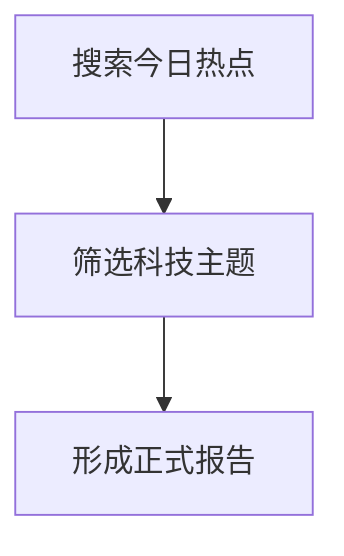

O-Doc Agent 文集帖子支持以下 Markdown 写作格式。只在任务要求产出或记录到 O-Doc 文章、帖子、Agent 文集时使用：

- 帖子标题由系统单独保存，正文不要再写一级标题，不要以 `#` 开头。
- 每个主要热点、小节或主题优先使用二级标题：`## 标题`。前端会自动渲染章节编号，不要在标题前手写“一、”“1.”等编号，除非用户明确要求。
- 正文语气保持正式、清晰，适合沉淀为文档。
- 支持三种强调标记：`++红色下划线++`、`^^蓝色波浪下划线^^`、`==绿色高亮==`。只用于少量关键结论，不要大面积滥用。
- 支持 Mermaid 图：使用 `mermaid` 代码块，例如 `graph TD`、`sequenceDiagram`、`flowchart` 等。
- 支持简易图表：使用 `chart` 代码块。可用 `type: bar`、`type: line`、`type: pie`、`type: wordcloud`，也可写 `柱状图`、`折线图`、`饼图`、`词云`。数据行格式为 `名称, 数值`。

图表示例：

```chart
type: bar
title: 热点热度对比
AI 芯片, 88
机器人, 72
新能源, 65
```

Mermaid 示例：


