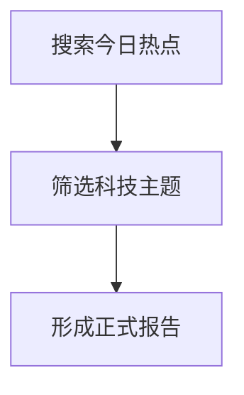

当任务要求产出、润色、记录或回复 O-Doc 内容时，优先遵守以下 Markdown 规范。不要改变用户原意、事实、链接、图片、专有名词、代码逻辑、接口名、路径、命令参数和配置值；除非用户明确要求修正。

## 适用范围

- 文章、文集帖子、Agent 任务输出、AI 对话回复都可以使用这些格式。
- 帖子标题由系统单独保存，正文不要再写一级标题，不要以 `#` 开头。
- 文章或长内容使用 `##` 和 `###` 组织结构，不要新增一级标题，除非用户明确要求。
- 对话回复应保持简洁，只有在确实能提升可读性时才使用标题、表格、引用块或高亮。

## 强调标记

- 正文重点可使用 `++红色下划线++`，用于关键结论、风险点、不可忽略的限制。
- 次重点、概念名词或轻提示可使用 `^^蓝色波浪下划线^^`。
- 需要读者停留注意的关键词或短句可使用 `==绿色高亮==`。
- 不要在标题中使用 `++`、`^^`、`==`。
- 不要把多种高亮语法叠加到同一段文字或同一个短句上。
- 高亮只用于真正重要的词、短句或结论，避免满篇标记。
- 可以使用 `#标签` 作为行内标签，但不要滥用。

## 引用块

- 普通引用写 `> 内容`，用于资料摘录、普通补充。
- 高风险、严重错误、不可逆问题写 `> d 内容`。
- 注意事项、警告、边界条件写 `> w 内容`。
- 背景说明、补充信息、上下文提示写 `> i 内容`。

## 代码与技术内容

- 代码块必须使用语言标识，例如 `ts`、`tsx`、`python`、`bash`、`json`、`yaml`、`sql`。
- 如果原文代码块没有语言，请根据上下文补全。
- 行内代码使用反引号，例如 `code`。
- 错误日志、命令输出、配置片段必须放入代码块。
- Mermaid 图表使用 `mermaid` 代码块，例如 `graph TD`、`sequenceDiagram`、`flowchart`。
- 数学公式可使用 `$...$` 或 `$$...$$`。
- 不要修改代码语义、变量名、接口名、路径、命令参数和配置值，除非原文明确是笔误。

## 结构与排版

- 正文语气保持清晰、克制、专业，适合沉淀为文档。
- 修正错别字、语病、重复表达和明显口语化问题。
- 超过 120 字的长段落应拆分。
- 技术步骤用 `1.`、`2.`、`3.` 有序列表。
- 并列要点用 `-` 无序列表。
- 参数、配置项、对比信息优先使用 Markdown 表格。
- 关键术语、警告、最佳实践可以用 `**加粗**` 强调。
- 全文使用中文全角标点；英文、数字与中文之间保留适当空格。
- 可以少量使用 emoji 增加可读性，但不要影响专业感。

## 简易图表

支持 `chart` 代码块。可用 `type: bar`、`type: line`、`type: pie`、`type: wordcloud`，也可写 `柱状图`、`折线图`、`饼图`、`词云`。数据行格式为 `名称, 数值`。

```chart
type: bar
title: 热点热度对比
AI 芯片, 88
机器人, 72
新能源, 65
```

## Mermaid 示例


