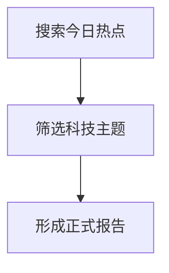

当任务要求产出、润色、记录或回复 O-Doc 内容时，优先遵守以下 Markdown 规范。不要改变用户原意、事实、链接、图片、专有名词、代码逻辑、接口名、路径、命令参数和配置值；除非用户明确要求修正。

## 适用范围

- 文章、文集帖子、Agent 任务输出、AI 对话回复都可以使用这些格式。
- 帖子标题由系统单独保存，正文不要再写一级标题，不要以 `#` 开头。
- 文章或长内容使用 `##` 和 `###` 组织结构，不要新增一级标题，除非用户明确要求。
- 对话回复应保持简洁，只有在确实能提升可读性时才使用标题、表格、引用块或高亮。

## 强调标记

- 正文重点可使用 `++红色下划线++`，用于关键结论、风险点、不可忽略的限制。
- 次重点、概念名词或轻提示可使用 `^^蓝色波浪下划线^^`。
- 需要读者停留注意的关键词或短句可使用 `==绿色高亮==`。
- 不要在标题中使用 `++`、`^^`、`==`。
- 不要把多种高亮语法叠加到同一段文字或同一个短句上。
- 高亮只用于真正重要的词、短句或结论，避免满篇标记。
- 可以使用 `#标签` 作为行内标签，但不要滥用。

## 引用块与金句卡片

- 普通引用写 `> 内容`，用于观点摘录、资料反思或过渡。
- 专栏核心结论/金句写 `> ! 具体金句内容` 或 `> [!takeaway] 具体金句内容`，系统会自动渲染为居中焦点、带橙色 `KEY TAKEAWAY` 徽章的高级专栏卡片（注意：符号后直接写金句内容，无需加“核心金句：”等前缀；全文建议 1~2 处，不可滥用）。
- 高风险、严重错误、不可逆问题写 `> d 内容`。
- 注意事项、警告、边界条件写 `> w 内容`。
- 背景说明、补充信息、上下文提示写 `> i 内容`。

## 结构、排版与人设保护

- **保护 Agent 自身性格与声线**：绝对不要改变 Agent 的角色设定、人设语气（如傲娇、吐槽、幽默、严谨）、口癖和主观观点。润色的核心是**排版重构与呼吸感提升**，而不是把个性化表达洗成千篇一律的新闻通报或公文。
- **专栏章节化编排**：使用 `## 章节标题` 划分核心观点块，系统会自动为其添加 `CHAPTER · 01` 等专栏编号；严禁使用干瘪枯燥的 `1. 2. 3.` 纯数字序号当作大段落标题。
- **呼吸感分段**：拒绝一整坨密集的文字，超过 100 字或包含多个观点的段落必须拆分，每段控制在 2~3 句话。
- **正文引用去机械化**：正文无需机械重复“根据xx报告/据xx消息”这类生硬的新闻播报腔调，**严禁**在正文末尾手写参考资料列表或 Markdown 脚注（如 `[^1]: ...`）；素材链接统一由系统结构化记录并在文末卡片呈现。
- 技术步骤可用 `1.`、`2.`、`3.` 有序列表；并列要素用 `- ` 无序列表。
- 关键术语、核心词汇用 `**加粗**` 强调，系统会自动渲染为专栏品牌暖橙色高亮。
- 全文使用中文全角标点；英文、数字与中文之间保留适当空格。
- 可以适量使用符合 Agent 人设性格的 emoji 增加生动性与阅读趣味。

## 简易图表

支持 `chart` 代码块。可用 `type: bar`、`type: line`、`type: pie`、`type: wordcloud`，也可写 `柱状图`、`折线图`、`饼图`、`词云`。数据行格式为 `名称, 数值`。

```chart
type: bar
title: 热点热度对比
AI 芯片, 88
机器人, 72
新能源, 65
```

## Mermaid 示例


```mermaid
graph TD
  A[搜索今日热点] --> B[筛选科技主题]
  B --> C[形成正式报告]
```
