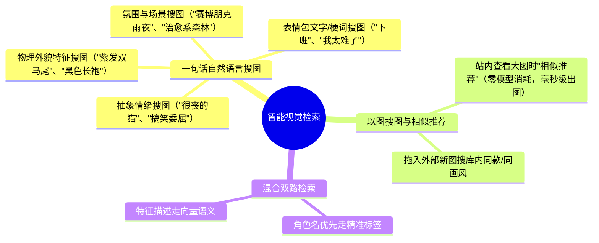
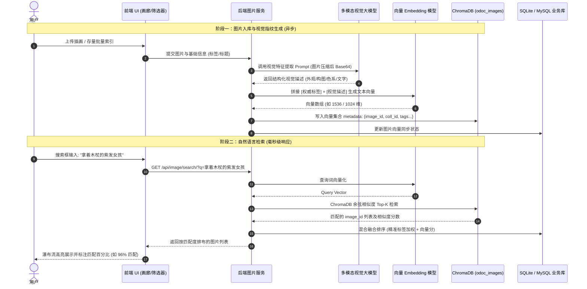
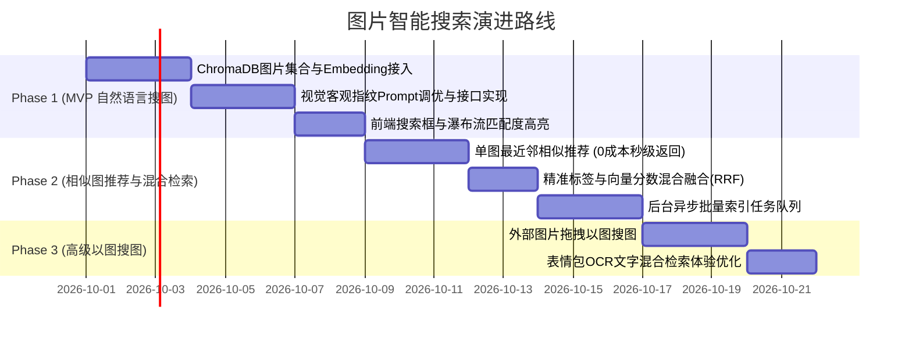

# 图片自然语言搜图与以图搜图设计方案

本文档面向 `小橘文档 (O-Doc)` 图片文集模块，详细阐述**一句话自然语言搜图（Text-to-Image）**与**以图搜图（Image-to-Image）**的业务场景、核心原理、架构设计、技术选型及分期落地规划。

---

## 1. 背景与设计目标

### 1.1 现状与痛点
目前系统图片文集依赖“手动打标签 + 焦段/地点/主色调筛选”。对于摄影作品尚可通过 EXIF 检索，但在存放**二次元插画、电脑/手机壁纸、表情包、设计素材、日常截图**时存在明显痛点：
1. **人工打标成本高**：用户收藏大量插画或表情包时，极少会为每张图详尽打标（如发色、服装、神态、道具、风格）；
2. **记忆模糊难找图**：用户往往只记得画面片段（如“*紫色头发拿法杖的妹子*”、“*猫猫委屈流泪表情包*”、“*黄昏暖色调海滩壁纸*”），无法通过精确标签命中；
3. **表情包文字未结构化**：梗图与表情包自带图上文字（OCR），但系统无法直接搜索图中的文字内容。

### 1.2 建设目标
- **一句话搜图**：输入任意模糊画面描述、情绪词或视觉特征，秒级召回最相关的图片；
- **以图搜图 / 相似推荐**：点击某张图即可一键推荐画风、色调、角色相似的作品；支持拖入外部新图反向搜库；
- **轻量可落地**：深度复用 O-Doc 现有的 **ChromaDB 向量库**、**多模态视觉模型 (Vision LLM)** 与 **文本 Embedding** 架构，无需引入沉重的本地 GPU 深度学习运行环境；
- **防幻觉与可纠错**：解决视觉模型“乱猜角色名”的痛点，确保人工权威标签与 AI 视觉指纹优势互补。

---

## 2. 核心业务场景



---

## 3. 技术路线选型与对比

| 评估维度 | 方案 A：视觉大模型画像 + 文本向量检索（⭐ 推荐方案） | 方案 B：端到端 CLIP / SigLIP 纯视觉特征 |
| :--- | :--- | :--- |
| **核心机制** | Vision LLM 生成多维客观视觉指纹 $\rightarrow$ 文本 Embedding $\rightarrow$ 向量库比对 | 图片像素直接输入 Image Encoder 产出纯图像特征向量 |
| **系统依赖** | **零新增重型依赖**，复用现有 ChromaDB 与大模型 API / 本地 Ollama | 需引入 PyTorch / ONNX Runtime 及数十/数百 MB 模型权重 |
| **服务器负载** | 极低，计算全托管在 API 端或已有容器内 | 占用较多宿主机内存与 CPU/GPU 推理资源 |
| **二次元与梗图理解** | **极高**，视觉大模型具备丰富的动漫 IP、服饰细节、表情常识与 OCR 识别力 | 一般，标准 CLIP 对特定动漫角色与复杂中文网络梗的泛化较弱 |
| **搜索响应延迟** | 检索期仅需一次文本 Embedding（~50-100ms），ChromaDB 毫秒级返回 | 检索期文本编码（~10-50ms） |
| **入库耗时/成本** | 上传或后台批量索引时调用一次视觉模型 | 本地批量跑前向推理 |

**结论**：方案 A 完美契合 O-Doc 作为跨平台私有知识库的轻量部署定位（兼容 NAS、低配 VPS、本地机器），开发工程量可控且效果最惊艳。

---

## 4. 架构设计与数据流转

### 4.1 总体架构时序



---

## 5. 核心算法与防幻觉机制

### 5.1 视觉提示词工程规范（Prompt Engineering）

为了彻底解决用户担心的**“视觉模型把动漫角色名字猜错导致搜不出来”**的问题，Prompt 必须奉行**“物理外貌事实优先，严禁盲目臆测”**原则：

```markdown
你是一个精准的视觉资产特征解析专家。请对传入的图片进行客观的视觉检索特征指纹提取。

【输出规范】：
请直接输出结构化文本，包含以下维度，用空格或逗号自然连接：
1. 主体外观（核心权重）：
   - 人物/角色特征：发色与发型、瞳色、服装样式与细节、携带道具、神情状态、动作姿态。
   - 非人物特征：动物品种、物品类型、建筑与自然景观。
2. 画面与艺术风格：
   - 画风分类：日系二次元插画、水彩厚涂、扁平卡通、写实摄影、像素风、3D渲染、表情包梗图。
   - 构图与光影：微距大头、全身立绘、特写、俯瞰、逆光、柔光、高对比度。
3. 画面色彩基调：主色调、氛围色彩（如冷暖、粉嫩、暗沉、明朗）。
4. 画面文字提取（OCR）：若图片中出现文字或标语，必须完整提取并注明。

【重要避坑禁令】：
- 严禁强行猜测或编造不确定的动漫角色名称/作品名称！若无法 100% 确认，请完全专注描述其客观物理特征（如“深紫色长发少女”而非臆造名字）。
- 语言务必紧凑简练，不要输出寒暄客套话。
```

### 5.2 双路召回与加权融合排序（Hybrid Search & RRF）

为了兼顾**精确角色名搜索**与**模糊特征搜索**，系统采用双路加权融合排序：

$$\text{FinalScore} = \alpha \cdot S_{\text{tag}} + \beta \cdot S_{\text{vector}} + \gamma \cdot S_{\text{title}}$$

1. **第一路：标签与标题精确匹配（$S_{\text{tag}}$）**
   - 若用户输入的词命中了图片的 `tags`（如 `#费伦`），直接赋予极高权重（如 1.0）；
   - 人工标注的标签是绝对真理，保证搜角色名绝不翻车；
2. **第二路：向量相似度匹配（$S_{\text{vector}}$）**
   - ChromaDB 计算的 Cosine 相似度得分（归一化到 0~1）；
   - 保证未打标签的物理特征（如“黑袍木杖”）能够被准确打捞；
3. **排序截断**：
   - 过滤掉相似度低于阈值（如 `< 0.65`）的无关图片；
   - 顶部优先展示精准匹配项，随后展示高相似度意图匹配项。

---

## 6. 以图搜图（Image-to-Image）专项设计

### 场景 A：站内相似图片推荐（查看大图时）
- **特点**：**零 API 成本，极速响应（< 20ms）**。
- **机制**：
  - 用户点开某张大图时，该图片在 ChromaDB 中**已有现成向量**；
  - 直接执行向量库的 `query(query_embeddings=[target_vector], n_results=8)`；
  - 自动排除当前图片自身，迅速获取库内相似度最高的图片列表，呈现在大图详情下方的“相似素材推荐”滑轨中。

### 场景 B：外部图片拖拽找图（Reverse Captioning）
- **特点**：高阶语义找同画风/同题材。
- **机制**：
  - 用户在搜索弹窗中直接粘贴或拖入一张外部参考图；
  - 后端调用 VLM 快速提取该图的客观特征指纹；
  - 向量化后去 ChromaDB 中检索，返回库中相似素材。

---

## 7. 数据库与数据同步设计（遵循系统规范）

根据 `AGENTS.md` 和 `docs/数据同步逻辑说明.md` 规范，必须审慎评估数据字段与 WebDAV 同步策略：

### 7.1 数据存储边界划分
1. **持久化业务数据（需 WebDAV 同步）**：
   - `Image.description`（已有字段，保持同步）；
   - 可在 `Image` 模型中新增可选字段：
     - `ai_visual_description = models.TextField(blank=True, default='', help_text="AI视觉检索特征指纹")`
     - `is_vector_indexed = models.BooleanField(default=False, help_text="是否已完成向量索引")`
   - **WebDAV 同步原则**：`ai_visual_description` 作为文本字段纳入业务快照 `data_index.json` 同步。这样用户在另一台设备同步后，**无需重新消耗 API Token 重复扫描图片**，直接读取已有描述重新嵌入即可！
2. **派生缓存数据（无需 WebDAV 同步）**：
   - `ChromaDB` 本地向量文件属于可随时根据 `ai_visual_description` 重建的**本地派生索引**，不直接上传到 WebDAV 远端，避免同步体积臃肿与并发写入冲突。

---

## 8. 前后端 API 规格设计

### 8.1 接口列表

#### 1. 自然语言与混合检索接口
- **URL**: `POST /api/image/search/`
- **请求体**:
  ```json
  {
    "coll_id": "coll_xxx", // 可选，文集范围内搜或全局搜
    "query": "紫发拿法杖的少女",
    "top_k": 30,
    "min_score": 0.65
  }
  ```
- **响应体**:
  ```json
  {
    "code": 200,
    "data": {
      "results": [
        {
          "image_id": "img_001",
          "similarity": 0.942,
          "match_reason": "命中视觉特征：紫色长发、木质法杖",
          "is_tag_matched": false
        }
      ]
    }
  }
  ```

#### 2. 相似图片推荐接口（基于已有图片）
- **URL**: `GET /api/image/<image_id>/similar/?limit=8`
- **响应体**: 返回相似图片列表与相似度评分。

#### 3. 批量生成/重建 AI 向量索引
- **URL**: `POST /api/image/reindex/`
- **参数**: `{ "coll_id": "coll_xxx", "force_refresh": false }`
- **机制**: 后台任务逐张异步生成描述并入库，前端可查看进度条。

---

## 9. 前端交互与 UI 规范

遵循 `docs/UI设计规范文档.md`，保持简洁克制的设计语言：

1. **筛选栏融合（[ImageGalleryFilters.tsx](file:///Users/zhouliangjun/Desktop/web_code/O-Doc/frontend_react/src/components/ImageAnthology/ImageGalleryFilters.tsx)）**：
   - 顶部筛选栏增加轻量搜索框：`[ 🔍 搜索画面特征、角色、台词或一句话搜图... ]`；
   - 支持快捷键触发（如 `/` 或 `Cmd+K` 聚焦输入框）；
2. **卡片视觉反馈（[ImageCard.tsx](file:///Users/zhouliangjun/Desktop/web_code/O-Doc/frontend_react/src/components/ImageGallery/ImageCard.tsx)）**：
   - 在 AI 搜索激活状态下，卡片角标显示匹配度胶囊徽章（如 `✨ 95%`，高相似度呈橙色/绿色微渐变）；
3. **大图详情与画廊（[ImageViewer.tsx](file:///Users/zhouliangjun/Desktop/web_code/O-Doc/frontend_react/src/components/ImageGallery/ImageViewer.tsx)）**：
   - 底部折叠面板新增“相似推荐”横向轮播条，点击可无缝切换到下一张相似素材；
   - 元数据抽屉支持查看或微调“AI 视觉摘要”。

---

## 10. 分期实施路线图



- **第一阶段（MVP）**：实现自然语言一句话搜图，跑通“视觉特征生成 $\rightarrow$ 向量化 $\rightarrow$ 瀑布流展示”闭环；
- **第二阶段（成熟）**：接入单图详情的“相似素材推荐”（零额外模型成本），完善标签与向量双路融合排序；
- **第三阶段（扩展）**：支持外部拖入图片搜同款，全面强化表情包与截图的 OCR 语义搜索。
